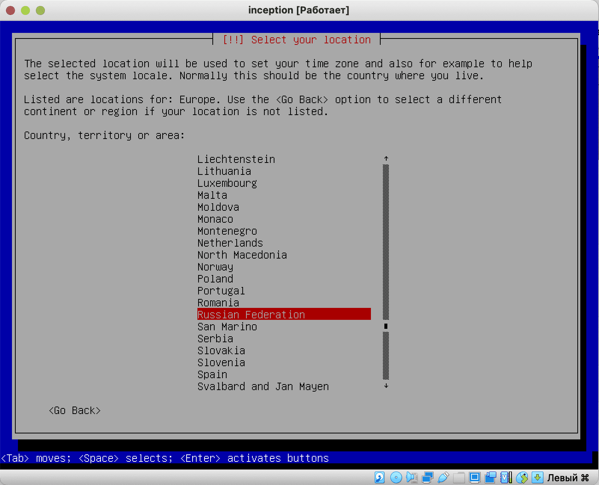
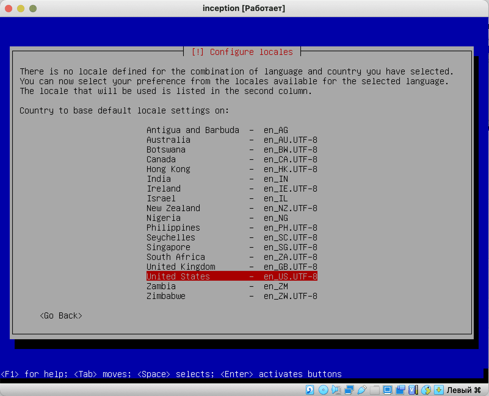
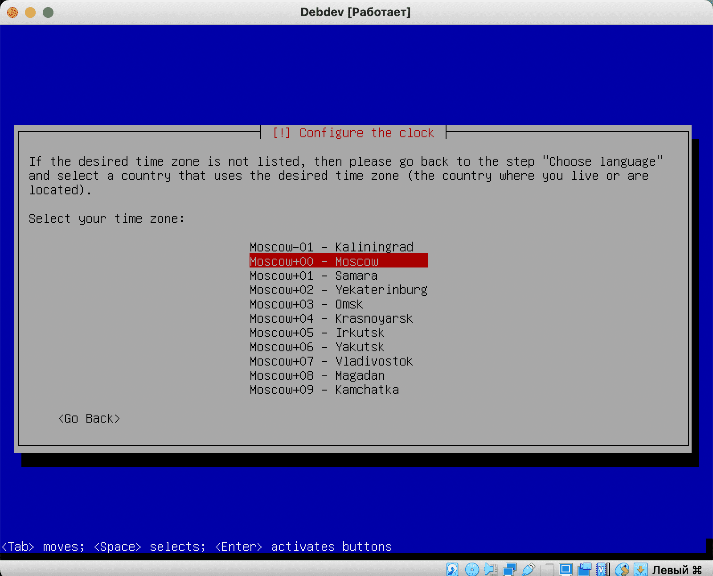
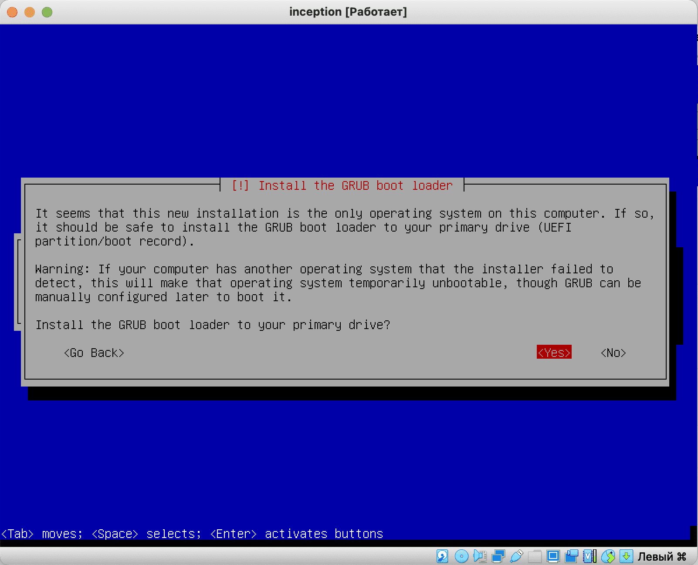
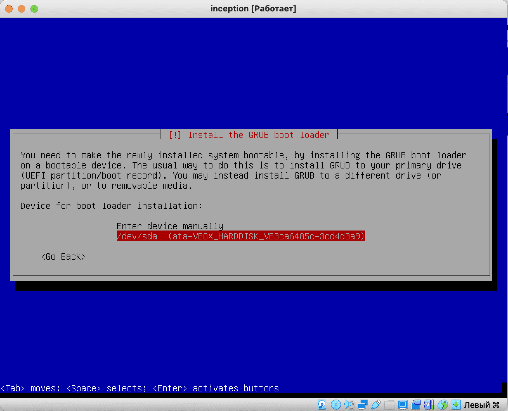
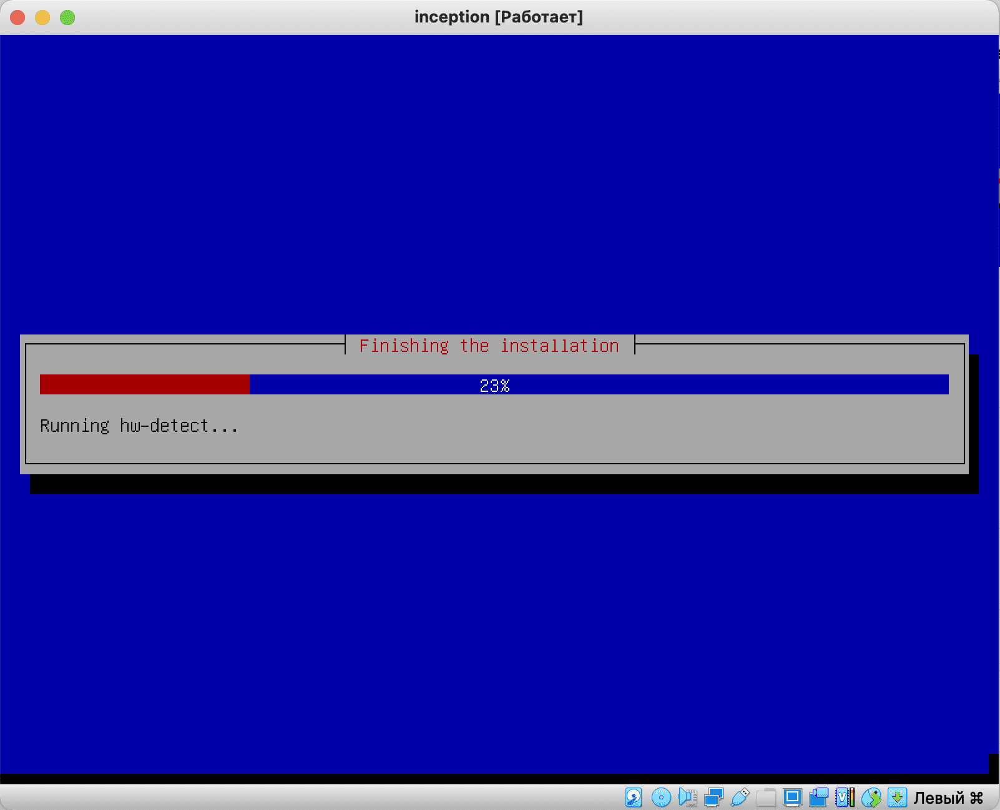

# Installing Debian Linux in Virtualbox

So, we start the project. Even if we have not encountered containerization before, and born2beRoot seemed like a nightmare to us, we should not be upset, since this guy will guide us through all stages of the project, starting with the basics of containerization with simple examples and ending with the bonus part. In general, we should be in a fighting mood, like this guy:


All we need is straight hands, a school poppy, or any personal computer with installed software from VirtualBox. Go.
## Step 1. Download

Go to [official website](https://www.debian.org/ "download debian") and download the web installer


## Step 2. Launch

### 2.1 Creating a virtual machine

We create a virtual machine. Let’s name our project something (I just called it Debian) and set the correct system configuration. If the project is being done on a school Mac, its folder should be placed in goinfre:


### 2.2 Resource Allocation

RAM for the project can be allocated from 512 MB if the PC has 4-8 GB to 4096 MB if the PC has 16 or higher. It makes no sense to allocate more than 4 GB of memory for this project.


Select the format VDI or VHD:


Select a dynamic format and allocate 8 gigabytes for the disk


Also, do not forget to set a convenient screen resolution (scaling factor) if you are working on a Mac.

On mac 200% or 300% is usually ok:


### 2.3 CPU resource allocation

You can also add more cores to the system. Adding more than four is redundant:


## Step 3. Installation

### 3.1 Start installation

After all the settings, we launch our project. At startup we are greeted with an installation menu. I choose a regular installer, but if you wish, you can use a graphic one, it’s a matter of taste.


### 3.2 Selecting language and location

We can choose American English (other languages ​​are simply not needed on the project), and specify Russia as the location:




And we leave English as the base locale:




### 3.3 Setting up host and users

Next, the system will prompt you to select a host name. You can call the host inception, but I left the default name ```debian```:


We skip the domain name, leaving the line empty.

The system will prompt us to set the superuser name (root). I assign a simple password to root - the number ```2```.

Next, we will be asked to name the regular user. I enter my nickname in the intro:


I accept the same name as the account name and enter a simple password - one

### 3.4 Setting time zones

Select your time zone.



### 3.5 Disk partitioning

Next, the markup program will launch. We don't have to go into the details of the Linux file system, so we select ```use entire disk``` - use the entire disk.


We select the only virtual disk available to us:


We choose to store all files in one section:


And we give the command to complete the markup and write the changes to disk:


We confirm the seriousness of our intentions:


### 3.6 Basic system installation


After marking, the installation of the basic system will begin. Next, I will describe only those steps that are important to us; the remaining steps can be skipped by pressing ```enter```

We simply skip all the extra fluff like an additional CD image, selecting repository mirrors, or polling the popularity of packages.

### 3.6.1 Software selection

We only need an ssh server, so use a space to uncheck everything else. We will later install a lighter openbox as a graphical environment - we will only need it to open our site. We don't need system utilities either.


### 3.6.1 Software selection

In the end, the system will finally tell us that it wants to install the system bootloader on the main partition:



Select a section (we have only one):



And the installation is completed:



We accept the offer to complete the installation:


Thus our system is installed. Let's move on to the next guide and download all the software we need!
