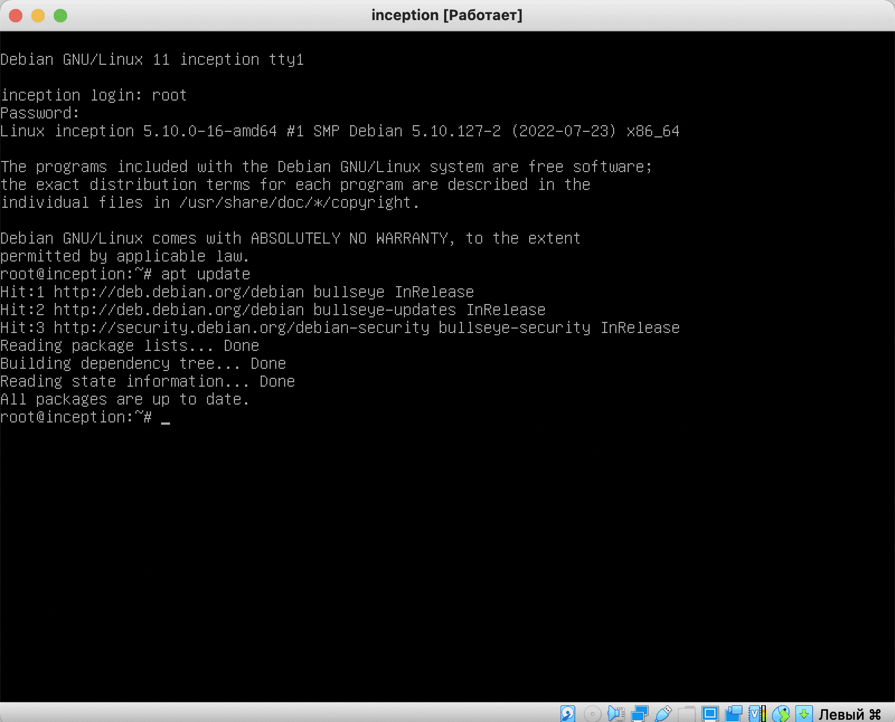
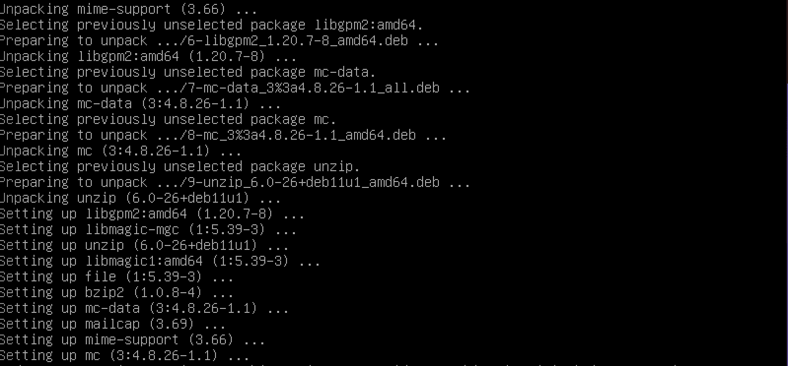
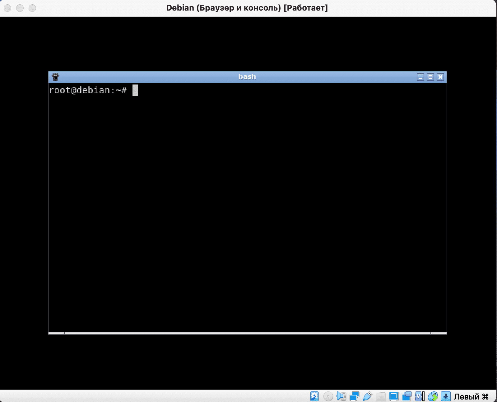

# Installing the necessary software in Debian

### Step 1. Login to the system

After installation and the first boot, we will be asked to select our system:


Let's boot as superuser by entering the root username and password.

> ! When you enter a password, the password itself will not be displayed on the screen. This is normal and done for safety reasons.


### Step 2: Update repository lists

Let's update the repositories with the ```apt update``` command:



### Step 3. Install applications

After that, install the applications we need with the following command:

```apt install -y sudo ufw docker docker-compose make openbox xinit kitty firefox-esr```

We will enter this command manually, since copy-pasting cannot be done into a virtual machine. Later we will open the ports and connect to the virtual machine via the console as if we were connecting to a local server.

In the meantime, we may make a mistake when entering this command:


And in this case, the system will tell us the name of the package/packages whose name we made a mistake:


Correct the package name and start the installation:


When installing, we will see output similar to this:



This means that we did everything right. At the end of the installation we will see the console output again.

Now let's check the software we installed. First, let's launch the openbox graphical environment.

x-server is responsible for graphics in Linux. We launch it with the command ```startx```

We will see a black screen. Don't despair, everything works!

If we hover over this black square and right-click on it, we will see a pop-up menu for launching applications. This is how the lightweight openbox environment works. Let's run the command line inside our GUI:




Now we have the opportunity to work either through a GUI terminal or through a TTY terminal.

Let's launch our web browser to check its operation. To do this, select the second item ```Web Browser``` in the application launch menu:


The ObConf utility (fourth point) will help in configuring our GUI, which will allow you to change the theme or set the wallpaper.

So, we have checked all the software we need. Now we can exit the GUI by selecting the last menu item ```Exit```


So we've made the necessary settings and now we have something called lol:


And in the next guide we will forward ports to this something.
