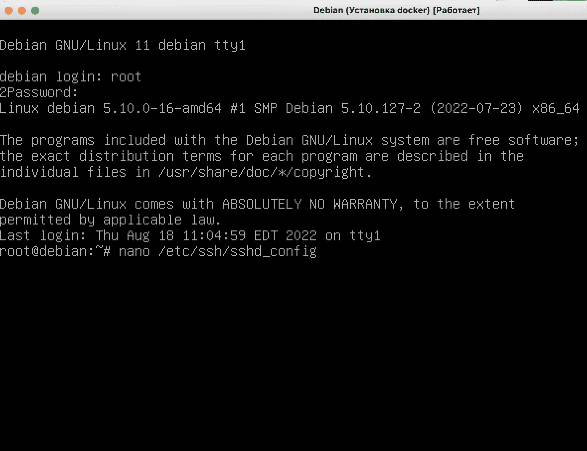
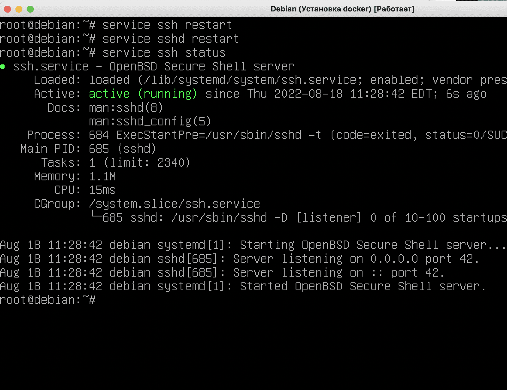
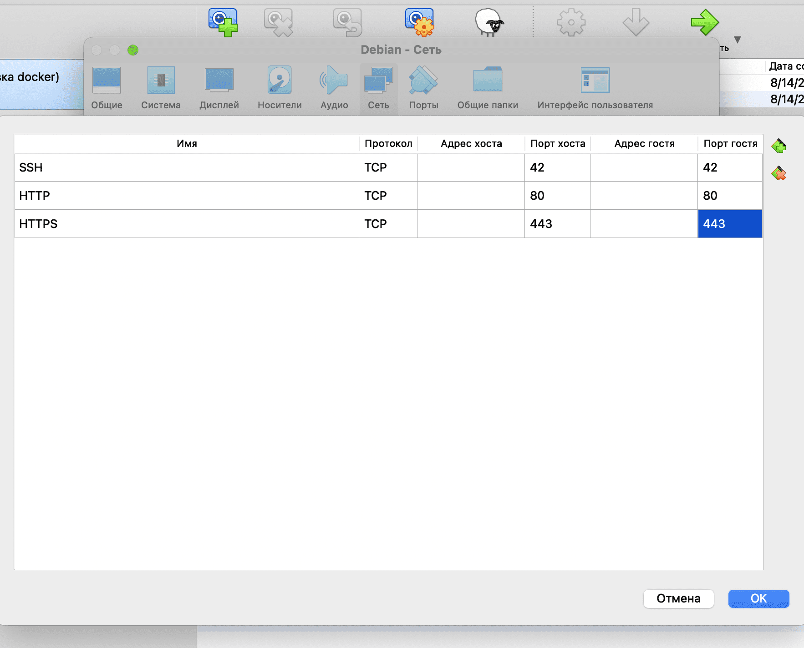

# Port forwarding in a virtual system

## Step 1: Set up ssh configuration

Login as superuser and open the file ```/etc/ssh/sshd_config```



Everything that happens next is unsafe settings for the virtual guest system, do not repeat it on vps servers!

We change the port to 42 (on a school Mac, for example, 22 is already occupied by the ssh of the host machine and you won’t be able to connect via it) and allow logging in as a superuser


Disable login using a key (in general it’s not necessary, but I did) and confirm login using a password:


After that, save the configuration and restart the ssh and sshd services (generally sshd is enough, but it’s a habit to do both to be sure):



## Step 2. Configuring the firewall

At the ``system installation`` step we have already installed the ufw firewall (more precisely, ufw is an add-on to the iptables firewall, but for the purposes of our task we will not delve into these technologies).

Next, we need to open our port 42 for ssh in the firewall, as well as ports 80 and 443 for the website.

First, we launch our firewall with the command ```ufw enable```, then we allow each port with the directive ```ufw allow N```, where N is the port number:


Open ports can be viewed using the command ```ufw status```

At this point, the settings in the system are completed; you need to shut down the virtual machine with the command ```shutdown now```

The ```shutdown``` command will shut down the server in a minute, so we use ```shutdown now``` to complete it instantly:


## Step 3. Port forwarding

It’s not enough to open ports on the guest machine; you also need to redirect traffic from the host to the guest. Traffic going through certain ports must be redirected by port forwarding from the guest machine to the host machine.

In Virtualbox, go to settings -> network -> advanced -> port forwarding, and set the following rules:



## Step 4. Login via host OS terminal

First, you need to make sure that there are no local entries (starting with [localhost]) on the host machine in ~/.ssh/known_hosts. If there are such lines and there are problems with logging in, then they will need to be deleted.

After we have forwarded the ports, we need to start the virtual machine again.

There is no need to log in, you can minimize the virtual machine window and log into our server through the terminal.

To log in as superuser:

```ssh root@localhost -p 42```

To log in as a regular user, use the username we created:

```ssh <your_nickname>@localhost -p 42```

Click yes to accept the settings in known_hosts, enter our password and voila - we are on the guest machine!


Congratulations, now we can copy-paste commands into the terminal, and they will be executed on our virtual server!

This means that we have the opportunity to quickly copy-paste and deploy our project!


But this is for those peers who are pressed by deadlines; for the rest, it is better to do everything step by step for a better understanding of the principles of operation of containers. Containers are a very useful thing, and the ability to competently containerize your code will give every programmer great advantages in the labor market.
