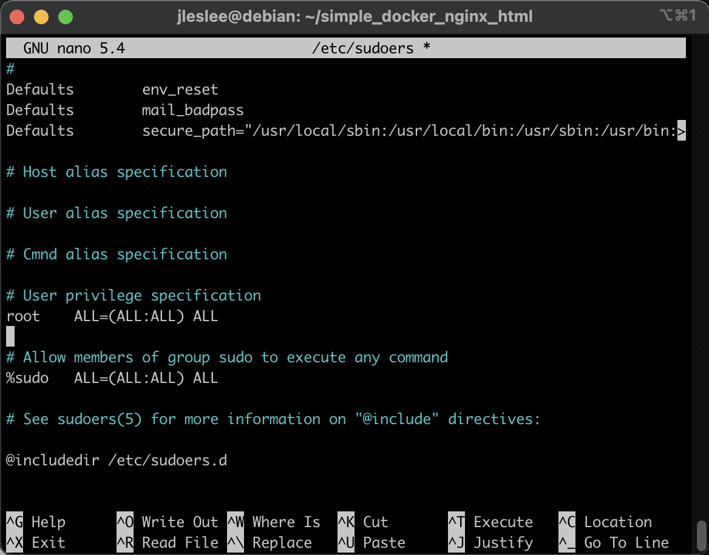
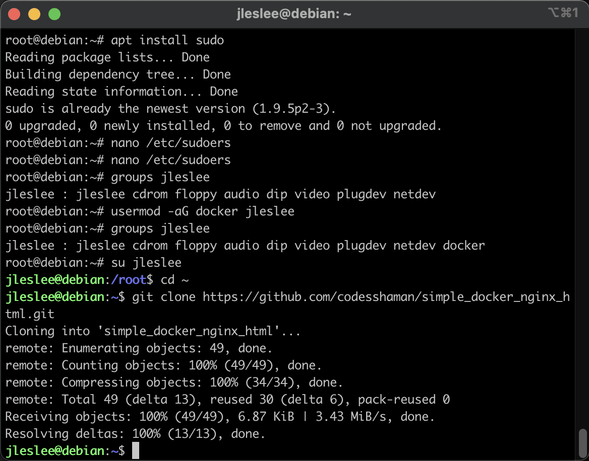

# Pre-configuring Docker

> Don't forget to take a snapshot of the state before each new build step!

## Step 1. Install and configure sudo

Now we need to start working with Docker. First, let's make it convenient for us, and also test its operation.

> It is better to perform all actions in this guide through the terminal so that you can copy-paste commands and code

At this point we will need our terminal. Login through the terminal, and not into virtualbox, first as a superuser:

```ssh root@localhost -p 42```

By default, Docker is launched either with superuser privileges, or by any user who is a member of the docker group and has the ability to make requests as superuser (for example, via sudo).

Previously, we installed the sudo utility, which allows the user to make queries as root.

In order for our user to make such requests in the system, we edit the /etc/sudoers config:

```nano /etc/sudoers```

Our task is to add an entry with our user name and rights equivalent to root rights:




Save the changes and close the file.

## Step 2: Add a user to the docker group

Now let's add our user to the ```docker``` group. This will allow us to execute docker commands without having to call sudo. (yes, we installed sudo not for Docker, but for the convenience of working with the system).

This is what the list of our user’s groups looks like now:

```groups <your_nickname>```


Let's add our user to the group with the command

```sudo usermod -aG docker <your_nickname>```

And let's check that the addition happened:

```groups <your_nickname>```


As we can see, the docker group has been added to the list of groups at the very end. This means that we can now call our docker as a regular user (if we added to the group not as root, but as a user via sudo, we need to re-login).

## Step 3. Test configuration

So let's switch to our user and go to his home directory:

```su <your_nickname>```

```cd ~/```

We will also download a simple configuration from one Docker container to the root to check the operation of the system:

```git clone https://github.com/codesshaman/simple_docker_nginx_html.git```



Now we can go to this folder and start the container:

```cd simple_docker_nginx_html```

```docker-compose up -d```

After some time, our container will fail and we will see a message about successful launch:


This means we can test the running container and the correct configuration settings. Open the browser of the host machine to check this.

If at step 02 when forwarding ports we did everything correctly, then port 80 is open, and by going to the browser at the local host address ```http://127.0.0.1``` (namely http, not https!) we will see the following picture:


If suddenly we see something different, it means that our ports are not open or port 80 is occupied with something on the host machine. Go through guide 01 and make sure the ports are open, and also check all running applications. If among them there are servers or other applications for working with the local host, disable them.

## Step 4. Create project directories and files

Next, we need to create many directories and files according to the task.

This is a routine task in which there is nothing complicated: the ```mkdir``` command creates a directory, the ```touch``` command creates a file, ```cd``` moves us along the relative or absolute path specified after the command , and ```cd ..``` takes us to the directory above. Also ``pwd`` shows where we are, ``cd ~`` returns us to the home directory.

If you don’t want to do this routine, I made a script make_directories.sh that performs all these actions automatically.

``nano make_directories.sh``

Here is his code:

```
#!/bin/bash
mkdir project
mkdir project/srcs
touch project/Makefile
mkdir project/srcs/requirements
touch project/srcs/docker-compose.yml
touch project/srcs/.env
echo "DOMAIN_NAME=<your_nickname>.42.fr" > project/srcs/.env
echo "CERT_=./requirements/tools/<your_nickname>.42.fr.crt" >> project/srcs/.env
echo "KEY_=./requirements/tools/<your_nickname>.42.fr.key" >> project/srcs/.env
echo "DB_NAME=wordpress" >> project/srcs/.env
echo "DB_ROOT=rootpass" >> project/srcs/.env
echo "DB_USER=wpuser" >> project/srcs/.env
echo "DB_PASS=wppass" >> project/srcs/.env
mkdir project/srcs/requirements/bonus
mkdir project/srcs/requirements/mariadb
mkdir project/srcs/requirements/mariadb/conf
touch project/srcs/requirements/mariadb/conf/create_db.sh
mkdir project/srcs/requirements/mariadb/tools
echo "" > project/srcs/requirements/mariadb/tools/.gitkeep
touch project/srcs/requirements/mariadb/Dockerfile
touch project/srcs/requirements/mariadb/.dockerignore
echo ".git" > project/srcs/requirements/mariadb/.dockerignore
echo ".env" >> project/srcs/requirements/mariadb/.dockerignore
mkdir project/srcs/requirements/nginx
mkdir project/srcs/requirements/nginx/conf
touch project/srcs/requirements/nginx/conf/nginx.conf
mkdir project/srcs/requirements/nginx/tools
touch project/srcs/requirements/nginx/Dockerfile
echo ".git" > project/srcs/requirements/mariadb/.dockerignore
echo ".env" >> project/srcs/requirements/mariadb/.dockerignore
mkdir project/srcs/requirements/tools
mkdir project/srcs/requirements/wordpress
mkdir project/srcs/requirements/wordpress/conf
touch project/srcs/requirements/wordpress/conf/wp-config-create.sh
mkdir project/srcs/requirements/wordpress/tools
echo "" > project/srcs/requirements/wordpress/tools/.gitkeep
touch project/srcs/requirements/wordpress/Dockerfile
touch project/srcs/requirements/wordpress/.dockerignore
echo ".git" > project/srcs/requirements/wordpress/.dockerignore
echo ".env" >> project/srcs/requirements/wordpress/.dockerignore
```

> Don't forget to change <your_nickname> to your nickname!

In the tools directories of wordpress and mariadb, we create an empty .gitkeep file, which serves only to ensure that these empty folders are indexed by git. Without it, they will not be uploaded to the repository. We won’t use these folders, since mariadb and wp will only have one config each. We will perform most simple operations directly in the dockerfile, eliminating the need for extra files from the outside.

Let's create a file with a .sh extension and add this code there:

``cd ~/``

``nano create_folders.sh``


It must be given permission to execute:
``chmod +x create_folders.sh``

After this you can run it:

``./create_folders.sh``

And Voila - all the directories of our project (and even some necessary files in them) have been created!


Well, if you still want to learn bash and do everything by hand, you can look at the contents of the script. In it, I use relative paths, being in the user's root directory, but you can navigate through directories and make folders inside other folders.
