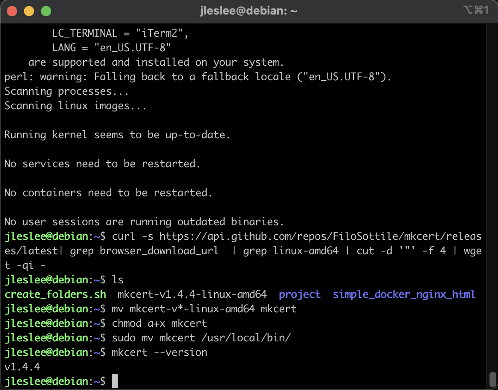
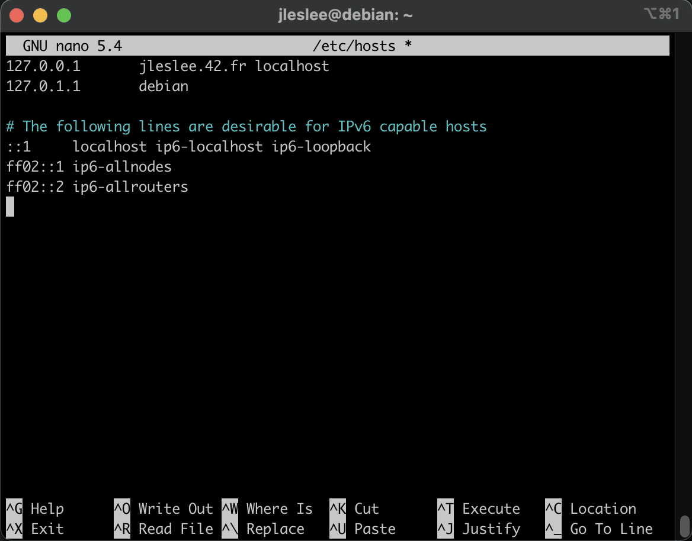
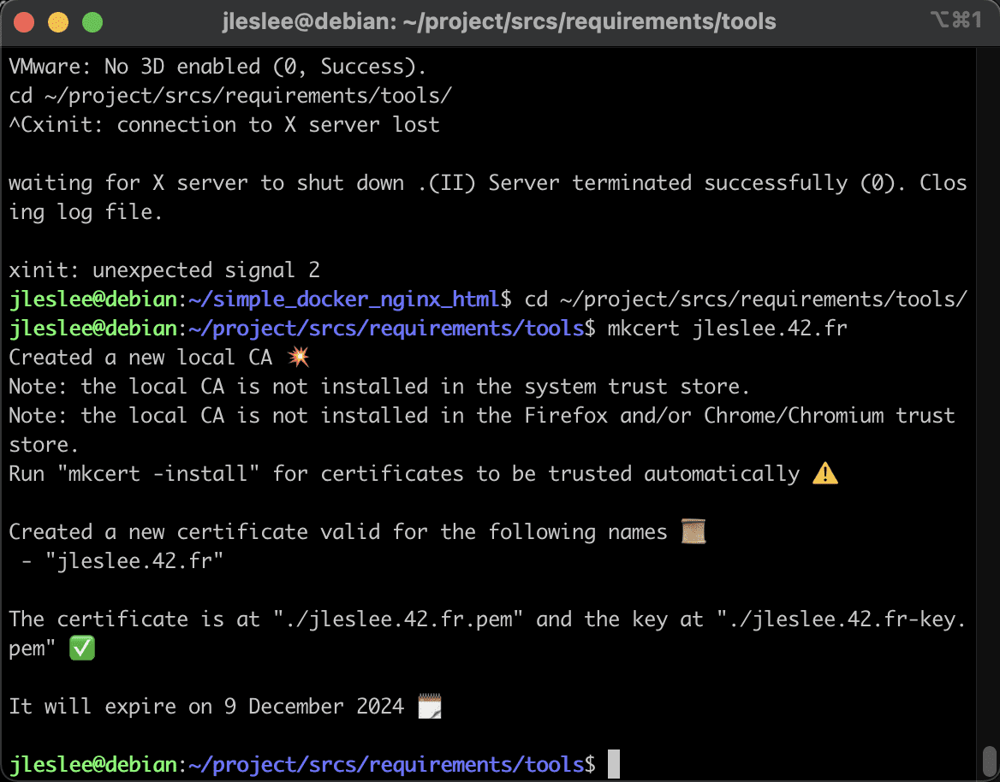
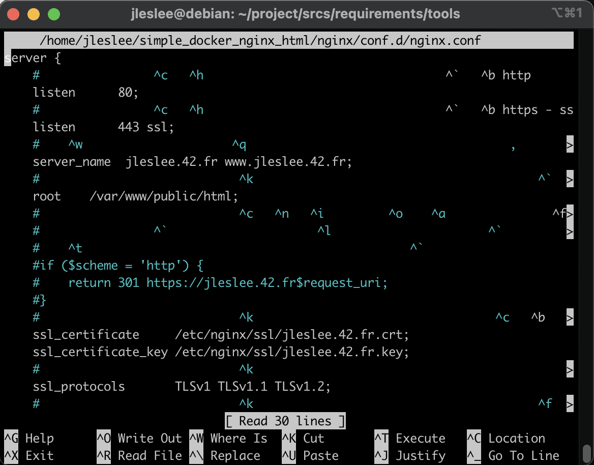
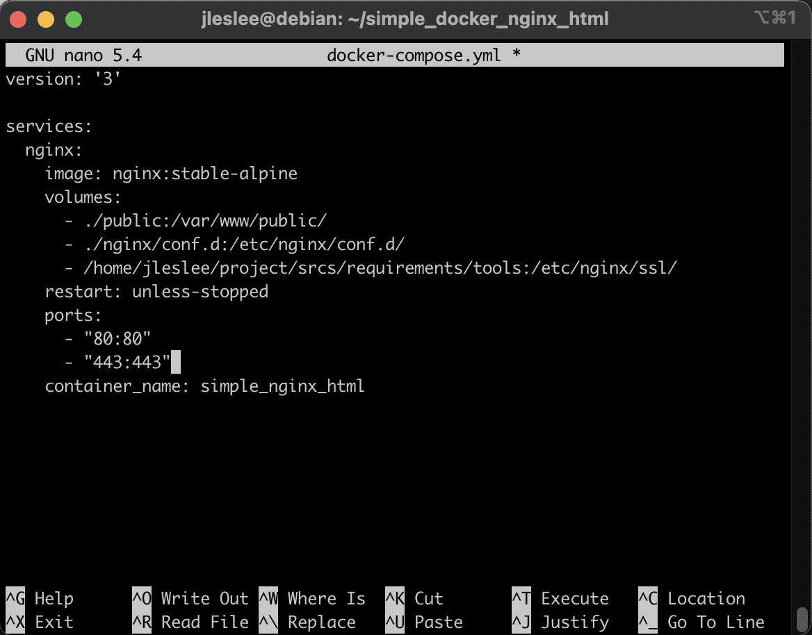
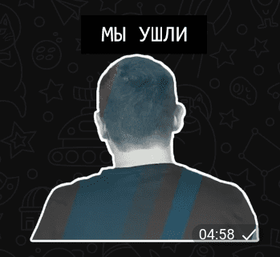

# Changing the local domain and installing certificates

## Step 1. Install mkcert

According to the assignment, we need to install a self-signed SSL certificate and work on port 443, and also change our domain name to username.42.fr. Let's start with a self-signed certificate.

The things that I will tell you in this guide are unknown to many. But for local development on Linux, especially in the web field, they will be extremely useful.


For local development, self-signed certificates are typically used. And to generate a self-signed certificate, it is very convenient to use the mkcert utility.

We log in via ssh as our regular user and execute the following commands:

Update the list of repositories:

```sudo apt update -y```

We install utilities that will help us download mkcert:

```sudo apt install -y wget curl libnss3-tools```

Download the mkcert binary:

```curl -s https://api.github.com/repos/FiloSottile/mkcert/releases/latest| grep browser_download_url | grep linux-amd64 | cut -d '"' -f 4 | wget -qi -```

Rename the downloaded file:

```mv mkcert-v*-linux-amd64 mkcert```

Allow all users to execute the file:

```chmod a+x mkcert```

And finally we move mkcert to the working directory:

```sudo mv mkcert /usr/local/bin/```

We check that everything works by requesting the mkcert version:

```mkcert --version```

We see the following output:



## Step 2. Change local domain

Next, we need to change the alias of our local domain (127.0.0.1) to the desired nickname.42.fr. Open the /etc/hosts file:

```sudo nano /etc/hosts```

And add our nickname.42.fr to ```localhost```, in my case it is ```jleslee.42.fr``` (the order is not important):



To test the domain's functionality, we can run our test container again:

```cd ~/simple_docker_nginx_html/ && docker-compose up -d```

Now run the following command:

```sudo startx```

This command starts x-server, which is necessary for rendering the graphical environment (GUI). We will see the following output:


As we can see from these logs, our graphics launched successfully, but... We won’t see it. This is because the terminal communicates with users using text and is not intended for rendering graphics. It’s not for nothing that the terminal interface is called TTY (tee-tee-wye) from the English Teletype Writer, one of the names of a typewriter. This kind of hints to us that the terminal is intended only for text, and therefore, it did everything it could - it gave us a log about the successful launch of the graphical environment.

The graphics launched in the window of the system running in virtualbox, and we can only use it there.

However, if we end the “X” session in the terminal by pressing ```Ctrl + C```, then the graphics in the virtual machine will immediately drop. Well, if we were already logged into the GUI, then by command from the terminal on top of the first graphical session, the second one will be launched, and upon exiting to ```Ctrl + C``` it will drop, leaving the first one enabled.

This is how xserver, popularly “X”, works - if it is launched in the terminal, you need to open a system window in virtualbox and work in it. It’s even easier to log in and launch graphics with a browser in virtualbox, and execute commands in the terminal.

Let's go to our graphical environment in the virtualbox window. Having turned on the web browser, enter the address http://<your_nickname>.42.fr/ into it, replacing <your_nickname> with your nickname. The result should be as follows:


As we can see, we have a local domain, but there is no certificate.

## Step 3. Obtaining a certificate

Let's minimize our graphical shell and open the terminal again. Now we have to get our self-signed certificate.

Let’s put the certificate and key in the project/srcs/requirements/tools/ folder (it’s not for nothing that we were given this folder according to the assignment). First, let's go there:

```cd ~/project/srcs/requirements/tools/```

To obtain the certificate we will use our mkcert. This is how I will generate a certificate for my domain <your_nickname>.42.fr:

```mkcert <your_nickname>.42.fr```

The result is the following:



As you can see, our certificate is valid for more than two years, and this is good.

The only thing we need for complete happiness is to change the file extensions so that the nginx server reads them correctly. We use mv, not forgetting to change <your_nickname> to your nickname:

```mv <your_nickname>.42.fr-key.pem <your_nickname>.42.fr.key```

```mv <your_nickname>.42.fr.pem <your_nickname>.42.fr.crt```

And we end up with a key with a certificate in the formats we need.

## Step 4. Reconfiguring the container for https

Now we need to change the settings of nginx and the test project to test the operation of https.

Let's change the settings of the nginx config, which is located at ~/simple_docker_nginx_html/nginx/conf.d/nginx.conf:

```nano ~/simple_docker_nginx_html/nginx/conf.d/nginx.conf```

We erase the entire contents of the file and copy the following code there:

```
server {
# Listen to http port
listen 80;
# Listen to port https - ssl
listen 443 ssl;
# Set the domain on which we will work:
server_name <your_nickname>.42.fr www.<your_nickname>.42.fr;
# Specify the root directory of the project:
root /var/www/public/html;
# The following section is commented out for
# normal operation from the host machine.
# We redirect from http to https:
#if ($scheme = 'http') {
# return 301 https://<your_nickname>.42.fr$request_uri;
#}
# Specify the path to the certificate and key:
ssl_certificate /etc/nginx/ssl/<your_nickname>.42.fr.crt;
ssl_certificate_key /etc/nginx/ssl/<your_nickname>.42.fr.key;
# Specify supported tls protocols:
ssl_protocols TLSv1.2 TLSv1.3;
# Specify caching options and timeouts:
ssl_session_timeout 10m;
keepalive_timeout 70;
# Tell the server what file extension it has
# need to look in our root folder (root)
location/{
try_files $uri /index.html;
}
}
```

We can make sure that Cyrillic comments after copy-paste are saved in the wrong encoding, but this will not affect the work of our project in any way:



We will definitely change <your_nickname> to your nickname in five places! Now we need to go to the test project folder and stop the container:

```cd ~/simple_docker_nginx_html/ && docker-compose down```

Then we open our docker-compose.yml:

```nano docker-compose.yml```

In the volumes section we add another section with our keys:

```- /home/${USER}/project/srcs/requirements/tools:/etc/nginx/ssl```, where ${USER} is a variable that will substitute our user name from the $PATH environment here.

In general, we’ll make sure that the paths to the certificates are written correctly, and we’ll also open port 443 in the ports section:

```
version: '3'

services:
nginx:
image: nginx:stable-alpine
volumes:
- ./public:/var/www/public/
- ./nginx/conf.d:/etc/nginx/conf.d/
- /home/${USER}/project/srcs/requirements/tools:/etc/nginx/ssl/
restart: unless-stopped
ports:
- "80:80"
- "443:443"
container_name: simple_nginx_html
```



## Step 5. Launching the project via https in the GUI

Now let’s launch our docker again with the command

```docker-compose up -d```

Let's log in to the system window, launch our X's there and go to the server GUI. Let's refresh the browser page and see that the browser, alas, does not trust our self-signed certificate:


Unfortunately, this is the most we can achieve. A self-signed certificate is not trusted because certificates are issued by special certification authorities. All we can do is click the “Advanced” button, then scroll down the page and click “Accept the risk and continue”:


Now our browser trusts the certificate we created and our site loads via ssl. However, the connection is still not considered secure. The browser needs to be understood and forgiven, and for us as a web developer this is quite enough for our project.


## Step 6. Launching the project via https on the host

On the host machine, our project will be available at ```127.0.0.1``` as long as the redirect section in the nginx config is commented out. If we uncomment it, we will be redirected to our 42.fr, and the school poppy does not know such a site.

There will also be complaints about self-signed ssl. Understand, forgive, click “additional” -> “go to site”.


We will see the already familiar “unsecure” https:


At this point we can turn off the container with the command

```docker-compose down```



and move on to creating a Makefile!
