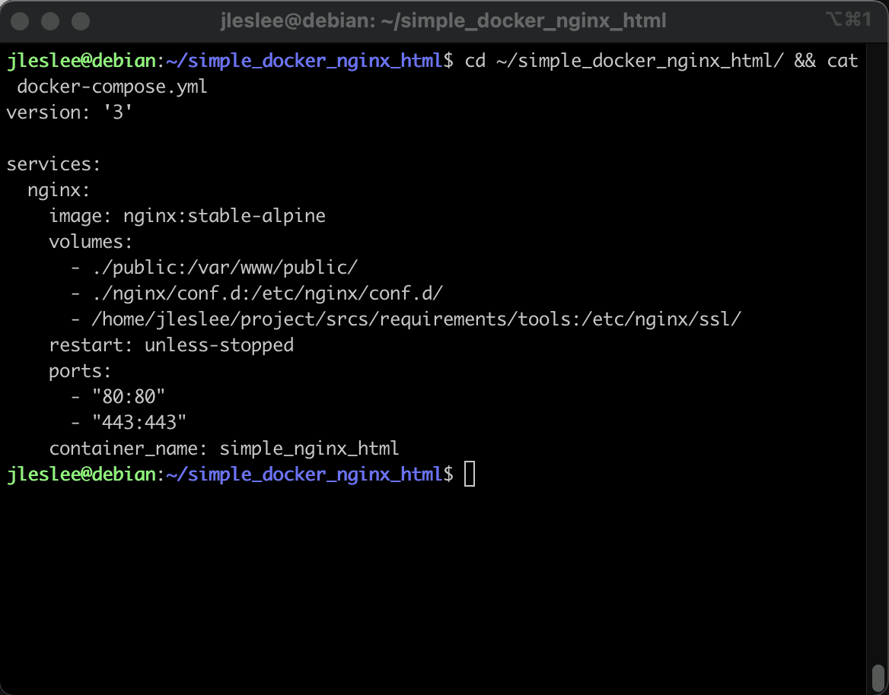

# Create a Makefile

Before a complex project, we will also practice creating a ```Makefile```. Let's practice on our "cats" with a ready-made configuration. For the combat project, we will make the makeup more complicated, because there will be more containers there. Well, to understand the principles, it’s best to start from simple to complex - write a make-up for a project from one container.

## Step 1. Find out the name of our container

While in the project folder, let's cat output our docker-compose:

```cd ~/simple_docker_nginx_html/ && cat docker-compose.yml```



In the ```container_name``` section we will see the name of the container: ```simple_nginx_html```. One of the reasons to give containers names is the fact that it will be convenient to refer to them by name.

## Step 2. Setting the variable

Let's create our Makefile in the same directory (~/simple_docker_nginx_html/):

``nano ~/simple_docker_nginx_html/Makefile``

The first variable in our Makefile will be the name variable, which we will assign to the name of the container:

```
name = simple_nginx_html
```

In some cases we will use this, for example, to display logs or to access a specific container by its name.

## Step 3. Run configuration

A container is launched in docker-compose using the docker-compose up -d command. But the fact is that compose supports a great many configurations. Often programmers and devops engineers have a separate configuration for development, a separate one for tests, and a third for production.

In our case, there is only one configuration, and we can write our command directly in the Makefile. However, let's be smarter and point docker-compose to our configuration file:

```@docker-compose -f ./docker-compose.yml up -d```

The dot and slash mean that we are running the file in the same directory where the Makefile is located. The beauty of this approach is that:

a) we can specify a different path to the configuration, both relative and absolute

b) we can use different configuration names, for example, test.yml and deploy.yml instead of the canonical name docker-compose.yml

So our all section will look like this:

```
all:
@printf "Running configuration ${name}...\n"
@docker-compose -f ./docker-compose.yml up -d
```

## Step 4. Configuration build

The container is assembled with the command ```docker-compose up -d --build```. Let's use it to create the following stopping section in the Makefile, let's call it build:

```
build:
@printf "Building configuration ${name}...\n"
@docker-compose -f ./docker-compose.yml up -d --build
```

## Step 5. Stopping the configuration

The command ```docker-compose down``` stops the container. Let's use it to create a stop section in the Makefile, call it, for example, down:

```
down:
@printf "Stopping configuration ${name}...\n"
@docker-compose -f ./docker-compose.yml down
```

## Step 6. Rebuilding the configuration

The command ```docker-compose up -d --build``` is responsible for rebuilding containers and applying changes. Let's create a re section with this command, which is responsible for rebuilding:

```
re:
@printf "Rebuilding configuration ${name}...\n"
@docker-compose -f ./docker-compose.yml up -d --build
```

## Step 7: Clearing the configuration

Well, how can you live without clean and fclean? Of course, in Docker these commands are much less useful than in C, and the result of their work is not directly visible. However, if we want to clear memory, remove unnecessary partitions and docker networks, they will be useful to us.

```docker system prune --a``` is a command that removes all unused images.

If we only need images of running containers, and all the rest are already waste material, then by executing this command while the containers are running, we clean up all unused images.

Let's create a clean section:

```
clean: down
@printf "Cleaning configuration ${name}...\n"
@docker system prune -a
```

## Step 8: Deep clean all configurations

Well, on fclean we can use total cleaning. To clean up all the images that are on the machine, we will first stop all running containers with the command ```docker stop $$(docker ps -qa)```, then forcefully (with the --force flag) delete everything that is bad ( and everything that lies well, too).

Next we will delete all networks and all connected partitions. Our code will look like this:

```
fclean:
@printf "Complete clearing of all docker configurations\n"
@docker stop $$(docker ps -qa)
@docker system prune --all --force --volumes
@docker network prune --force
@docker volume prune --force
```

You should run ```make fclean``` only when you really want to build the entire project with make from scratch.

Thus, our entire Makefile consists of the following code:

```
name = simple_nginx_html
all:
@printf "Running configuration ${name}...\n"
@docker-compose -f ./docker-compose.yml up -d

build:
@printf "Building configuration ${name}...\n"
@docker-compose -f ./docker-compose.yml up -d --build

down:
@printf "Stopping configuration ${name}...\n"
@docker-compose -f ./docker-compose.yml down

re:down
@printf "Rebuilding configuration ${name}...\n"
@docker-compose -f ./docker-compose.yml up -d --build

clean: down
@printf "Cleaning configuration ${name}...\n"
@docker system prune -a

fclean:
@printf "Complete clearing of all docker configurations\n"
@docker stop $$(docker ps -qa)
@docker system prune --all --force --volumes
@docker network prune --force
@docker volume prune --force

.PHONY : all build down re clean fclean
```

Well, here’s a version with English comments for the lazy (you can copy-paste it into the terminal):

```
name = simple_nginx_html
all:
@printf "Launch configuration ${name}...\n"
@docker-compose -f ./docker-compose.yml up -d

build:
@printf "Building configuration ${name}...\n"
@docker-compose -f ./docker-compose.yml up -d --build

down:
@printf "Stopping configuration ${name}...\n"
@docker-compose -f ./docker-compose.yml down

re:down
@printf "Rebuild configuration ${name}...\n"
@docker-compose -f ./docker-compose.yml up -d --build

clean: down
@printf "Cleaning configuration ${name}...\n"
@docker system prune -a

fclean:
@printf "Total clean of all configurations docker\n"
@docker stop $$(docker ps -qa)
@docker system prune --all --force --volumes
@docker network prune --force
@docker volume prune --force

.PHONY : all build down re clean fclean
```

May English experts forgive me.

Let's test this Makefile on our test container and then move on to the production project!

Let's write something longer than the dog's arrangement... Well, in general, you understand me.


> And don’t forget to take a snapshot and save as a cloud!
