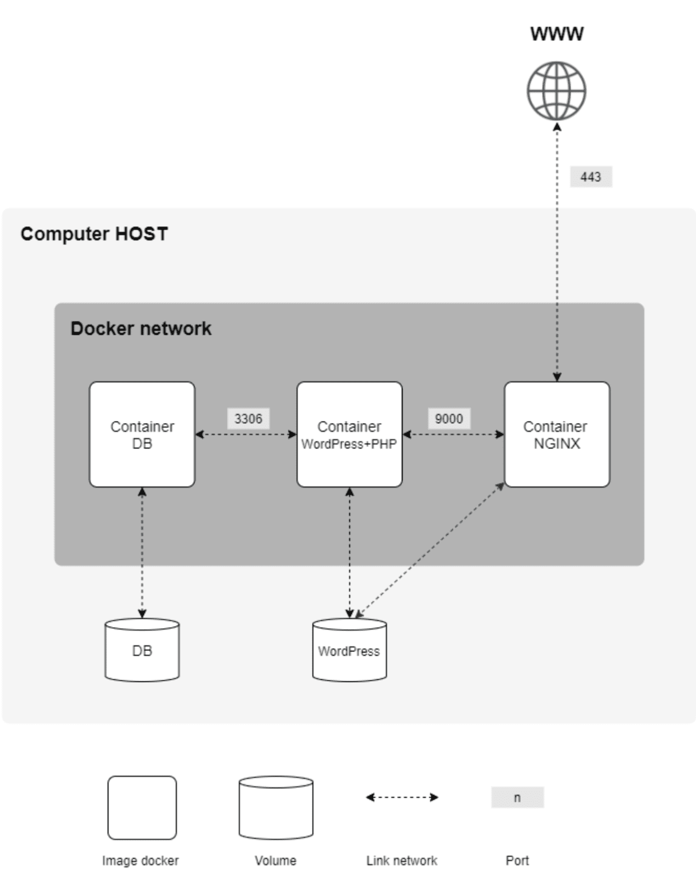
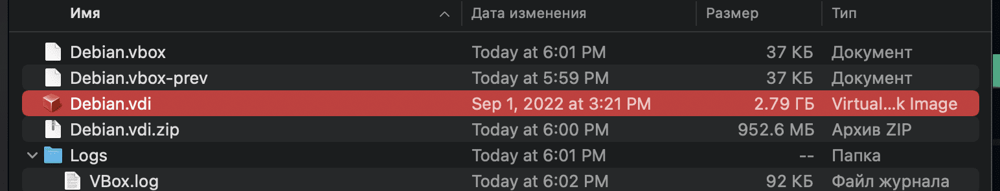

# Create an Nginx container

And so we took a snapshot, saved the configuration to the cloud or to a flash drive and are ready to start deploying containers for the project itself.

First, let's get acquainted with the technologies that we will use in our containers.

Our assignment gives the following diagram:



Let's see what software we need to implement what is shown in the diagram:

Technology | Destination | Creator | Ports
------ | ------ | ------ | ------ |
Nginx | Proxying web server | Igor Sysoev (Russia) | 443 |
PHP | Scripting language for the web | Rasmus Lerdorf (Denmark) | - |
Php-Fpm | Set of libraries for FastCGI API | Andrey Nigmatulin (Russia) | 9000 |
Wordpress | Content Management System | Matthew Mullenweg (USA) | - |
MariaDB | Relational Database | Mikael Widenius (Finland) | 3306 |
---
This table immediately introduces us to the beautiful, because everything here is beautiful.

The best proxy web server, created by our compatriot Igor Sysoev, occupying 30% of the server market. It is this well-documented software that powers 30% of the Internet and the lion’s share of large and highly loaded sites, because this server has been written for high loads since 2002.

This is what we will be setting up in this guide, but for now let’s get acquainted with the rest of the technologies we need.

The PHP language was created by the Dane Lerdorf for personal purposes in 1995, but it quickly gained popularity in web development and is still one of the leading languages ​​for the web.

The php-fpm library from our compatriot Andrey Nigmatulin has become a standard API between php and web servers, including Nginx. It is she who will make friends between our nginx and php. Installed in a container with php.

Wordpress is a wonderful and easy to configure CMS system, after studying which you can start accepting orders for freelance websites :). Created in 2003.

MariaDB is a lightweight analogue of the MySQL database. Both are the creation of the Finn Widenius, who named MySQL after his eldest daughter My, and MariaDB after his youngest daughter, Maria.

All of these technologies are relatively simple, clean, and functional, making them an excellent choice for both beginning web programmers and professionals.

And all this runs under the Linux OS - the wonderful creation of the Finn Linus Torvalds, on which the entire modern Internet is based, and runs inside Docker containers, a containerization system created by the American Solomon Hikes. The Linux kernel appeared in 1992-93, and Docker in 2013.


This is how two Americans, two Russians and two Finns created all the technologies we needed for the task. And somehow, by chance, a Dane living in Canada, the creator of one of the basic technologies - the very language that we use for WordPress - got in among them.

So, let's start setting up a server with Nginx.

## Step 1: Introduction to Docker

A Docker image is a set of environments necessary to run certain software. It differs from virtualbox-type emulators in that the container does not contain a full-fledged operating system, the container uses the Linux kernel and not everything is placed inside it, but only the programs and libraries necessary to run the software.

Thus, the container weighs significantly less than the emulated system. Let's see this clearly. Let's see how much our OS weighs in its installed form:



And compare this with the same image of the eleventh debian on [Docker Hub](https://hub.docker.com/ "docker hub") - the official Docker image repository:


The image weighs only 50 MB in compressed form (our compressed Debian disk weighed 950 MB!). Once unpacked, this image will weigh about 150 MB. That's such a significant difference. And this is far from the limit.

This is because to run individual software you do not need an entire full-fledged operating system, just a working kernel and some environment of all the dependencies - modules, libraries, packages and scripts. Wine works on this principle, the very name of which says that Wine is Not Emulator. It helps to run Windows applications in the Linux environment, installing only the necessary dependencies and nothing unnecessary.

We will use the lightweight alpine system, which is used for containers and microcontrollers, but can also be installed in an emulator or on real hardware. The system is extremely lightweight: about 50 megabytes with the kernel, 30 megabytes unpacked and 2.5 (!) megabytes compressed (yes, Linux repositories use advanced compression methods to save traffic, but a full-fledged OS weighing 2.5 MB is all equally surprising):


The difference between the compressed format and the same debian is as much as 20 times! This was achieved by optimizing everything and everyone, but this also imposes limitations. So the system uses a lightweight apk instead of the usual apt, there is no full-fledged bash, sh is used instead, of course, [its own set of repositories](https://pkgs.alpinelinux.org/packages "list of alpine packages") and many other features.

However, as with any open-source Linux, a lot can be added here. And it is this distro that has become the main one for many docker projects due to its low weight, high speed and high fault tolerance. The larger and more complex the system, the more points of failure, therefore, lightweight distributions have great advantages in this case.

So, when we finished the review and understood the differences between emulators and containers, we move on to studying how Docker works.

## Step 2: Create a Dockerfile

In Docker, a special file called Dockerfile is responsible for the configuration. It specifies a set of software that we want to deploy inside this container.

Let's go to our nginx folder:

```cd ~/project/srcs/requirements/nginx/```

We create a Dockerfile in it:

```nano Dockerfile```

And we write in it the FROM instruction, which indicates from which image we will deploy our container. By subject, we are prohibited from specifying labels like alpine:latest, which are automatically assigned to the latest versions of alpine in the dockerhub repositories. Therefore, we go to the [official website](https://www.alpinelinux.org/ “alpine versions”) of the system and see which release is the latest. At the time of writing this guide, it was alpine 3.16.2, but for the FROM statement it will be enough to indicate the minor version:

```FROM alpine:3.16```

More details about the instructions can be found in [this video](https://www.youtube.com/watch?v=wskg5903K8I "docker from Anton Pavlenko"), but here we will look at just a few of them.

Next, we specify what software and how we want to install it inside the container. The RUN instruction will help us with this.

The ``RUN`` instruction creates a new image layer with the result of the command called, similar to how the snapshot system saves changes to a virtual machine. Actually, the image itself consists of such layers-changes.

It is not possible to run an application directly from ``RUN``. In some cases this can be done through a script, but in general the ``CMD`` and ``ENTRYPOINT`` instructions are used to run it. ``RUN`` creates a static layer, changes inside which are written to the image, but do not cause anything, ``CMD`` and ``ENTRYPOINT`` run something, but DO NOT write changes to the image. Therefore, you should not execute scripts with them, the result of which must be “put” into the final image or partition. There is ``RUN`` for this.

We can say that changes made through ``RUN`` are static. For example, installing packages on a system is usually done like this:

```RUN apk update && apk upgrade && apk add --no-cache nginx```

Here we tell the apk file manager to update the list of its repositories in search of the latest software versions (apk update), update outdated packages in our environment (apk upgrade) and install nginx without saving the sources in the cache (apk add --no-cache nginx) . Works almost exactly like ```apt``` in debian.

Then we need to open the port on which the container will exchange traffic:

```EXPOSE 443```

In the end we have to run the installed configuration. To do this, use the ```CMD``` instruction:

```CMD ["nginx", "-g", "daemon off;"]```

This way we run nginx directly and not in daemon mode. Daemon mode is a launch mode in which the application starts in the background or, in Windows parlance, as a service. For ease of debugging, we disable this mode and receive all nginx logs directly into the tty of the container.

```
FROM alpine:3.16
RUN apk update && apk upgrade && apk add --no-cache nginx
EXPOSE 443
CMD ["nginx", "-g", "daemon off;"]
```
Here, in fact, is the entire Dockerfile. Simple, isn't it?


Save and close.

## Step 3. Create a configuration file

Naturally, our nginx will not work without a configuration file. Let's write it!

Having looked at our folder with nginx using ```ls``` we will find the conf and tools directories in it. Therefore, our configuration should be in the conf folder if we are normal white people (no racism, just a common phrase).

Let's create our config directly from here:

```nano conf/nginx.conf```

Since we have already trained with a test container, let’s take a similar configuration, changing it for php so that it allows reading not html, but php wordpress files. We will no longer need port 80, since according to the guide we can only use port 443. But at the first stage, we will comment out the sections responsible for php and temporarily add html support (for testing):
```
server {
listen 443 ssl;
server_name <your_nickname>.42.fr www.<your_nickname>.42.fr;
root /var/www/;
index index.php index.html;
ssl_certificate /etc/nginx/ssl/<your_nickname>.42.fr.crt;
ssl_certificate_key /etc/nginx/ssl/<your_nickname>.42.fr.key;
ssl_protocols TLSv1.2 TLSv1.3;
ssl_session_timeout 10m;
keepalive_timeout 70;
location/{
try_files $uri /index.php?$args /index.html;
add_header Last-Modified $date_gmt;
add_header Cache-Control 'no-store, no-cache';
if_modified_since off;
expires off;
etag off;
}
# location ~ \.php$ {
# fastcgi_split_path_info ^(.+\.php)(/.+)$;
#fastcgi_pass wordpress:9000;
# fastcgi_index index.php;
# include fastcgi_params;
# fastcgi_param SCRIPT_FILENAME $document_root$fastcgi_script_name;
# fastcgi_param PATH_INFO $fastcgi_path_info;
# }
}
```

Port 9000 is exactly the port of our php-fpm, through which the connection between php and nginx is made. And wordpress in this case is the name of our container with wordpress. But for now, let’s at least try to just run something on nginx.

We just copy-paste this into our project and save the file.

And I use the tools folder for keys, copying them there:

```cp ~/project/srcs/requirements/tools/* ~/project/srcs/requirements/nginx/tools/```


## Step 4: Create docker-compose configuration

Docker-compose is a system for launching Docker containers; one might say, it is a kind of add-on to Docker. If in docker files we specified what software to install inside one container environment, then with docker-compose we can control the launch of many similar containers at once, launching them with one command.

To do this, go two levels higher (``../../``) and edit our already created docker-compose file:

```cd ../../ && nano docker-compose.yml```

First we register the version. The latest version is the third.

```
version: '3'

services:
nginx:
```

The first on the list of our services will be nginx. Put two spaces and write this word.

Next, we tell the docker where our Dockerfile is:

```
version: '3'

services:
nginx:
build:
context: .
dockerfile: requirements/nginx/Dockerfile
```

We set a name for our container, and also forward the required port (in this task we can only use ssl).

Let’s also write down the dependency, commenting it out for now. We need nginx to start after WordPress, picking up its build. But nginx is built faster, and to avoid collisions, we need it to wait for the WordPress container to be built and start only after it. For now, let's comment this out for testing purposes.

```
version: '3'

services:
nginx:
build:
context: .
dockerfile: requirements/nginx/Dockerfile
container_name: nginx
#depends_on:
# - wordpress
ports:
- "443:443"
```

We add sections so that the container can see our config and our keys, and we also make sure to mount our /var/www - the same folder from the old configuration that we will need for a test run of nginx. Later we will delete it and take files from the WordPress directory.

```
version: '3'

services:
nginx:
build:
context: .
dockerfile: requirements/nginx/Dockerfile
container_name: nginx
#depends_on:
# - wordpress
ports:
- "443:443"
volumes:
- ./requirements/nginx/conf/:/etc/nginx/http.d/
- ./requirements/nginx/tools:/etc/nginx/ssl/
- /home/${USER}/simple_docker_nginx_html/public/html:/var/www/
```

Next we specify the type of restart. In combat projects, I personally use the restart type: unless-stopped (always restart, except for the stop command), but the subject prohibits it, so we set it to allowed:

```
restart: always
```

...which means restart anyway.

And thus we have the following configuration:

```
version: '3'

services:
nginx:
build:
context: .
dockerfile: requirements/nginx/Dockerfile
container_name: nginx
#depends_on:
# - wordpress
ports:
- "443:443"
volumes:
- ./requirements/nginx/conf/:/etc/nginx/http.d/
- ./requirements/nginx/tools:/etc/nginx/ssl/
- /home/${USER}/simple_docker_nginx_html/public/html:/var/www/
restart: always
```

Don't forget to turn off the test configuration:

```cd ~/simple_docker_nginx_html/```

```docker-compose down```

And we launch our new configuration:

```cd ~/project/srcs/```

```docker-compose up -d```

Since we are using port 443, and it only supports the https protocol, we will access the address using https:

```https://127.0.0.1``` in the browser

```https://<your_nickname>.42.fr``` in GUI

And now if we access localhost from the browser, we get a working configuration:


By simply replacing a few docker-compose values ​​and uncommenting the configuration file, we will get a working nginx that supports tls and works with wordpress. But that will come later.

In the meantime, we take snapshots, save to the cloud, pour in a liquid that is pleasant for the body and enjoy life. That's why we are devops engineers :)


