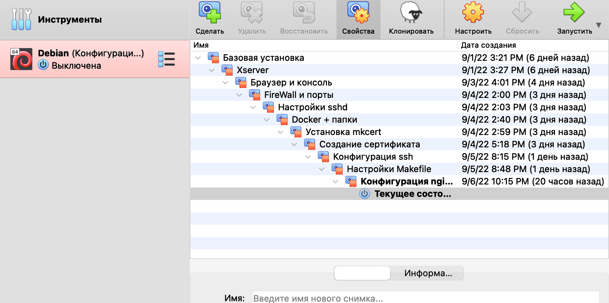
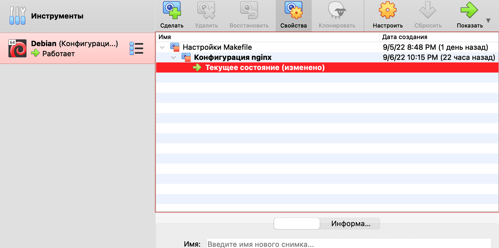

# Create a Mariadb container

At this step, the size of my snapshots exceeded two gigabytes, and it became difficult for me to download them from the cloud, since mail reduces the speed of files larger than 2 gigabytes.

Since I still won’t need to return to the old snapshots, I decided to leave only the new configurations and delete all the old ones.

This is what the list of my snapshots looked like before deletion:



That's how many of them are left after. As you can see, I left only the last ones.



The problem of low download speed has been resolved.

## Step 1: Create a Dockerfile

Let's see what the French want from us, ordinary Russian developers:


And all the same as from the nginx settings. Dockerfile and required configurations. To understand this more clearly, let’s conduct a review, as in the case of creating a WordPress configuration:

Here is a list of what we need to set up the container:

- installed mariadb + mariadb-client
- mysql configuration file
- mriadb configuration change.
- file for running the sql script
- sql script to create a worpdress database

Step-by-step setup plan:

- install mariadb + mariadb-client in Dockerfile
- change the mysql configuration (can be done directly in the Dockerfile, there are only a few lines there)
- change mariadb config (just one line, change directly in Dockerfile)
- copy the database settings config from outside
- create a file for an sql query
- add the body of the request to this file
- execute a database creation request
- create configuration for docker-compose
- correctly pass passwords and usernames through environment variables

In general, everything is “simple”; without a hundred grams you can’t figure it out. Let's start by creating a container.

Let's create a basic image of our container. In order not to create unnecessary configs, we will do the following:

``cd ~/project/srcs``

``nano requirements/mariadb/Dockerfile``

File contents:

```
FROM alpine:3.16

RUN apk update && apk add --no-cache mariadb mariadb-client

RUN mkdir /var/run/mysqld; \
chmod 777 /var/run/mysqld; \
{ echo '[mysqld]'; \
echo 'skip-host-cache'; \
echo 'skip-name-resolve'; \
echo 'bind-address=0.0.0.0'; \
} | tee /etc/my.cnf.d/docker.cnf; \
sed -i "s|skip-networking|skip-networking=0|g" \
/etc/my.cnf.d/mariadb-server.cnf

RUN mysql_install_db --user=mysql --datadir=/var/lib/mysql

EXPOSE 3306

USER mysql
COPY tools/db.sh .
ENTRYPOINT ["sh", "db.sh"]
CMD ["/usr/bin/mysqld", "--skip-log-error"]
```

Here we run the RUN instruction in which we install the mariadb and mariadb-client we need without caching. Next, in the same RUN we normalize our working configuration. We do this with one RUN because each RUN directive creates a new layer in the docker image, and it is better not to create extra RUNs unnecessarily. The tee command sends the output of echo to a file, and the sed command replaces lines in files by value. This way we set the minimum required set of settings without creating unnecessary configs inside one docker file.

With the second layer we create a database from what we installed and configured on the previous layer. We indicate the path where the default database will be stored. Then we open the mariadb working port and switch to the mysql user created when installing the database.

And finally, we launch the database under this user.

## Step 2. Script for creating a database

Let's create a script in the conf folder that creates a database for wordpress:

``nano requirements/mariadb/conf/create_db.sh``

Let's write the following code into it:

```
#!bin/sh

if [! -d "/var/lib/mysql/mysql" ]; then

chown -R mysql:mysql /var/lib/mysql

# init database
mysql_install_db --basedir=/usr --datadir=/var/lib/mysql --user=mysql --rpm

tfile=`mktemp`
if [! -f "$tfile" ]; then
return 1
fi
fi

if [! -d "/var/lib/mysql/wordpress" ]; then

cat << EOF > /tmp/create_db.sql
USE mysql;
FLUSH PRIVILEGES;
DELETE FROM mysql.user WHERE User='';
DROP DATABASE test;
DELETE FROM mysql.db WHERE Db='test';
DELETE FROM mysql.user WHERE User='root' AND Host NOT IN ('localhost', '127.0.0.1', '::1');
ALTER USER 'root'@'localhost' IDENTIFIED BY '${DB_ROOT}';
CREATE DATABASE ${DB_NAME} CHARACTER SET utf8 COLLATE utf8_general_ci;
CREATE USER '${DB_USER}'@'%' IDENTIFIED by '${DB_PASS}';
GRANT ALL PRIVILEGES ON wordpress.* TO '${DB_USER}'@'%';
FLUSH PRIVILEGES;
EOF
# run init.sql
/usr/bin/mysqld --user=mysql --bootstrap < /tmp/create_db.sql
rm -f /tmp/create_db.sql
fi
```

This bash script, in which everything is relatively complex and incomprehensible, but it was created for this purpose, so that when any programmer starting to study containerization sees it, he thinks “I can’t do this anymore”, “I’m getting tired” and in general “I can’t afford it.” That's what docker imagined!"


Well, okay, if we look closely at the code, we can understand the following:

The first block of code checks whether mysql is running (based on the presence of the database of the same name), and if not, it starts it. Checking in case something bad happens; in fact, our mysql must be installed and running, and this block is usually skipped.

The second block checks whether a database named wordpress exists. Of course, we don’t have it, and, falling inside this block, we write the sql code to create this database into the file for sql queries created in step 1.2. The code uses environment variables that we will pass from the env file. In the same block, we execute this code and delete the extra configuration file, skillfully covering our tracks like real hackers.

## Step 3. Execute the script

So, the script has been created, you need to execute it in the Dockerfile:

``nano requirements/mariadb/Dockerfile``

To do this, write the command:

```
COPY requirements/mariadb/conf/create_db.sh .
RUN sh create_db.sh && rm create_db.sh
```

But for the script to work, we must pass environment variables to create the database. Environment variables are taken from the .env file; these are the same secrets that, as a rule, are stored separately from the repository code. You can store them in encrypted sections or even in password managers like keepass. Their syntax is simple, they can be put into any application that supports text fields. The main thing is that no one can gain access to them.

Docker has two ways to pass environment variables to an image: via ARG and via ENV. Through ARG, those arguments are passed that will be used when building the image, and will not be used after it starts. Therefore, we will transfer all our secrets through the ARG, so that they do not hang around the already assembled image.

Variables that will be in the environment of an already running container are passed through ENV. We will not use them for our tasks.

Let's write our environment variables in the container:

```
ARG DB_NAME\
DB_USER\
DB_PASS
```

With everything needed, the Dockerfile looks like this:

```
FROM alpine:3.16

ARG DB_NAME\
DB_USER\
DB_PASS

RUN apk update && apk add --no-cache mariadb mariadb-client

RUN mkdir /var/run/mysqld; \
chmod 777 /var/run/mysqld; \
{ echo '[mysqld]'; \
echo 'skip-host-cache'; \
echo 'skip-name-resolve'; \
echo 'bind-address=0.0.0.0'; \
} | tee /etc/my.cnf.d/docker.cnf; \
sed -i "s|skip-networking|skip-networking=0|g" \
/etc/my.cnf.d/mariadb-server.cnf

RUN mysql_install_db --user=mysql --datadir=/var/lib/mysql

EXPOSE 3306

COPY requirements/mariadb/conf/create_db.sh .
RUN sh create_db.sh && rm create_db.sh
USER mysql
CMD ["/usr/bin/mysqld", "--skip-log-error"]
```

## Step 4. Docker-compose configuration

We continue to edit our docker-compose.yml

The mariadb section looks like this:

```
mariadb:
build:
context: .
dockerfile: mariadb/Dockerfile
args:
DB_NAME: ${DB_NAME}
DB_USER: ${DB_USER}
DB_PASS: ${DB_PASS}
DB_ROOT: ${DB_ROOT}
container_name: mariadb
ports:
- "3306:3306"
restart: always
```
As we can see, our variables are passed to the ARG through the args section in the build section. They can only be passed here, because they are launched only during the build and are not present in the image, unlike ENVs, which are passed through the environment section already inside the service.

Mariadb runs on port 3306, so this port must be open.

The entire docker-compose file:

```
version: '3'

services:
nginx:
build:
context: .
dockerfile: requirements/nginx/Dockerfile
container_name: nginx
#depends_on:
# - wordpress
ports:
- "443:443"
volumes:
- ./requirements/nginx/conf/:/etc/nginx/http.d/
- ./requirements/nginx/tools:/etc/nginx/ssl/
- /home/${USER}/simple_docker_nginx_html/public/html:/var/www/
restart: always

mariadb:
build:
context: .
dockerfile: requirements/mariadb/Dockerfile
args:
DB_NAME: ${DB_NAME}
DB_USER: ${DB_USER}
DB_PASS: ${DB_PASS}
DB_ROOT: ${DB_ROOT}
container_name: mariadb
ports:
- "3306:3306"
restart: always
```
## Step 5. Checking the database operation

In order to check if everything worked out, we need to run the following command after starting the container:

``docker exec -it mariadb mysql -u root``

This will put us in the text environment of the database:

``MariaDB [(none)]> ``

Here we enter the command

``show databases;``

In our case, the output should be as follows:

```
+--------------------+
| Database |
+--------------------+
| information_schema |
| mysql |
| performance_schema |
| sys |
| wordpress |
+--------------------+
5 rows in set (0.001 sec)
```
At the bottom there must be a database we created with the name ``wordpress``! If it is not there, then our script did not work correctly or did not work at all. This may be due to many reasons - the script file was not copied, the environment variables were not transferred, the wrong values ​​were written in the .env file...

But if everything is done correctly, then congratulations - we have successfully launched the database!

We exit the environment using the exit command or Ctrl+D.


