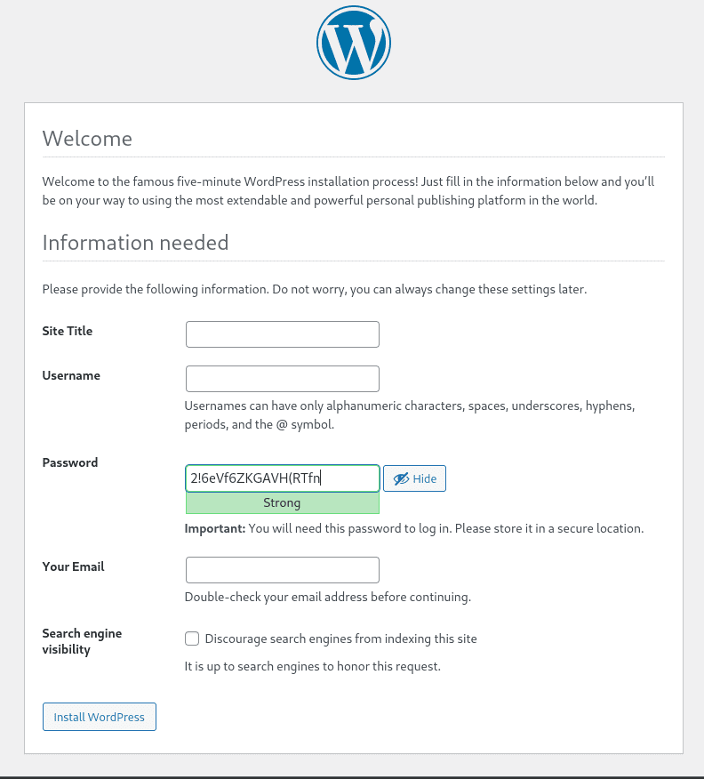
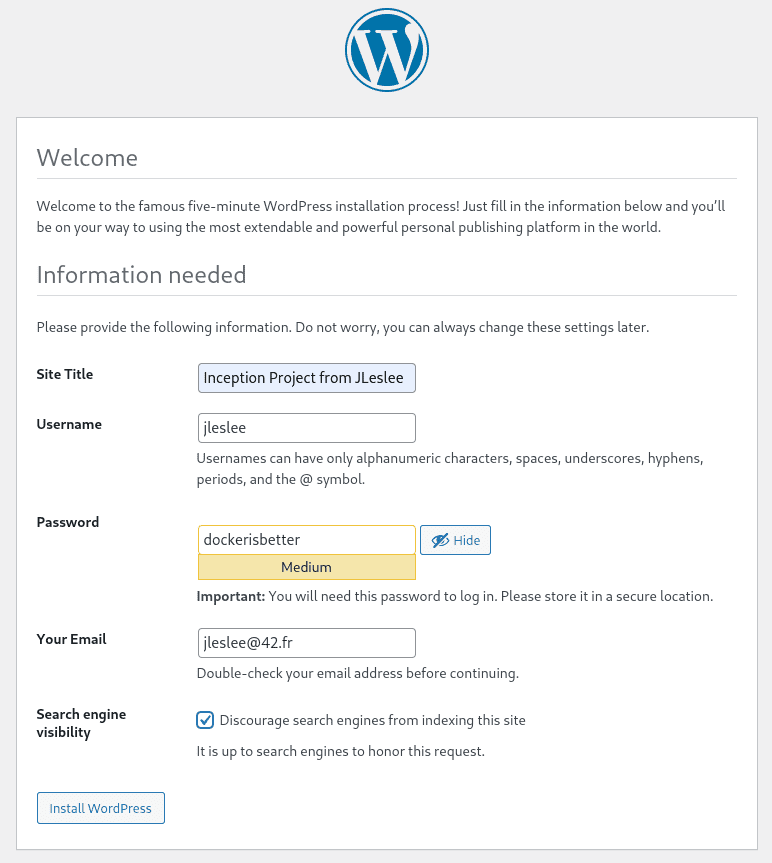
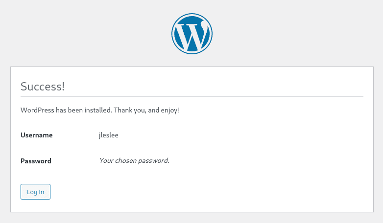
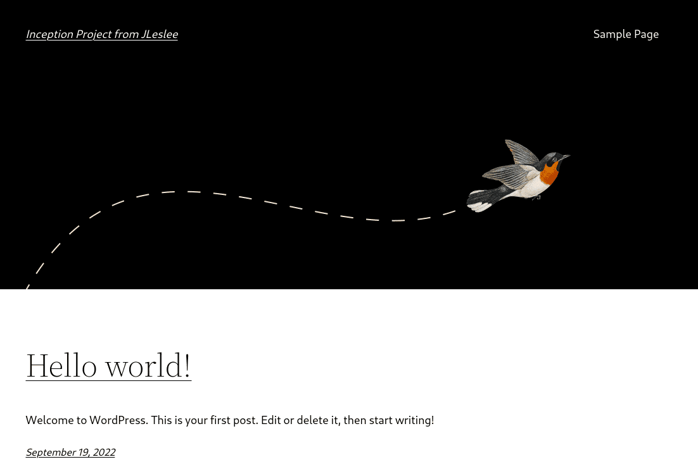

# Creating a WordPress container

For a general understanding, let’s do a small review of the task, breaking it down into a subtask.

First, let's write down a list of what we need for the container. This:

- php with plugins for working with wordpress
- php-fpm for communication with nginx
- WordPress itself. Just so it is.

To configure we need to perform the following steps:

- install via Dockerfile php with all plugins
- install all necessary programs via Dockerfile
- download and put WordPress itself in /var/www, also via Dockerfile
- insert the correct fastcgi config (www.conf) into the container
- run in fastcgi container via php-fpm socket
- add all necessary sections to docker-compose
- set the order in which containers are launched
- add a section with WordPress to the container with nginx
- test to make sure everything works

## Step 1: Configure Dockerfile

So, we move on to setting up WordPress. We proceed in the same way: we take the latest Alpine as a basis and roll out the software we need onto it.


Go to srcs and do:

``nano requirements/wordpress/Dockerfile``

But let’s roll it out smartly, indicating the current version of php for today. At the time of creation of the guide (2022) this is php 8, if a lot of time has passed since 2022, you need to go to [php official website](https://www.php.net/ "php official website") and see if newer version.

Therefore, I will indicate the PHP version in a variable - a command line argument. Sets the variable instruction ARG. Also, using this instruction, I accept three arguments from our .env file with secrets - the database name, user name and password.

The difference is that an ARG with parameters sets an environment variable with the passed parameter, while an ARG without parameters takes a parameter from the same variable in docker-compose.

First, let's list the basic components: this is php, on which our wordpress runs, php-fpm for interacting with nginx and php-mysqli for interacting with mariadb:

```
FROM alpine:3.16
ARG PHP_VERSION=8\
DB_NAME\
DB_USER\
DB_PASS
RUN apk update && apk upgrade && apk add --no-cache \
php${PHP_VERSION}\
php${PHP_VERSION}-fpm\
php${PHP_VERSION}-mysqli
```

Now let's go to [wordpress documentation](https://make.wordpress.org/hosting/handbook/server-environment/ "official wordpress documentation") and see what else we need.

For the full operation of our WordPress, we will not skimp and load all the required modules, omitting the caching and additional modules. For the bonus part, we will also install the redis module. We’ll also download the wget package needed to download Wordpress itself, and the unzip package for unzipping the archive with downloaded Wordpress:

```
FROM alpine:3.16
ARG PHP_VERSION=8\
DB_NAME\
DB_USER\
DB_PASS
RUN apk update && apk upgrade && apk add --no-cache \
php${PHP_VERSION}\
php${PHP_VERSION}-fpm\
php${PHP_VERSION}-mysqli\
php${PHP_VERSION}-json\
php${PHP_VERSION}-curl\
php${PHP_VERSION}-dom\
php${PHP_VERSION}-exif\
php${PHP_VERSION}-fileinfo\
php${PHP_VERSION}-mbstring\
php${PHP_VERSION}-openssl\
php${PHP_VERSION}-xml\
php${PHP_VERSION}-zip\
php${PHP_VERSION}-redis\
wget\
unzip
```

Next, we will correct the config we need - the www.conf config, so that our fastcgi listens to all connections on port 9000 (the path /etc/php8/php-fpm.d/ depends on the installed version of php!):

```
FROM alpine:3.16
ARG PHP_VERSION=8\
DB_NAME\
DB_USER\
DB_PASS
RUN apk update && apk upgrade && apk add --no-cache \
php${PHP_VERSION}\
php${PHP_VERSION}-fpm\
php${PHP_VERSION}-mysqli\
php${PHP_VERSION}-json\
php${PHP_VERSION}-curl\
php${PHP_VERSION}-dom\
php${PHP_VERSION}-exif\
php${PHP_VERSION}-fileinfo\
php${PHP_VERSION}-mbstring\
php${PHP_VERSION}-openssl\
php${PHP_VERSION}-xml\
php${PHP_VERSION}-zip\
php${PHP_VERSION}-redis\
wget\
unzip\
sed -i "s|listen = 127.0.0.1:9000|listen = 9000|g" \
/etc/php8/php-fpm.d/www.conf\
sed -i "s|;listen.owner = nobody|listen.owner = nobody|g" \
/etc/php8/php-fpm.d/www.conf\
sed -i "s|;listen.group = nobody|listen.group = nobody|g" \
/etc/php8/php-fpm.d/www.conf\
&& rm -f /var/cache/apk/*
```

The principle is the same as in the previous guide. We change three lines of the config with sed.

The last command we clear the cache of installed modules.

Next, we need to download wordpress and unzip it to the path /var/www/. For convenience, we will make this path a working one using the WORKDIR command:

```
FROM alpine:3.16
ARG PHP_VERSION=8\
DB_NAME\
DB_USER\
DB_PASS
RUN apk update && apk upgrade && apk add --no-cache \
php${PHP_VERSION}\
php${PHP_VERSION}-fpm\
php${PHP_VERSION}-mysqli\
php${PHP_VERSION}-json\
php${PHP_VERSION}-curl\
php${PHP_VERSION}-dom\
php${PHP_VERSION}-exif\
php${PHP_VERSION}-fileinfo\
php${PHP_VERSION}-mbstring\
php${PHP_VERSION}-openssl\
php${PHP_VERSION}-xml\
php${PHP_VERSION}-zip\
php${PHP_VERSION}-redis\
wget\
unzip && \
sed -i "s|listen = 127.0.0.1:9000|listen = 9000|g" \
/etc/php8/php-fpm.d/www.conf && \
sed -i "s|;listen.owner = nobody|listen.owner = nobody|g" \
/etc/php8/php-fpm.d/www.conf && \
sed -i "s|;listen.group = nobody|listen.group = nobody|g" \
/etc/php8/php-fpm.d/www.conf && \
rm -f /var/cache/apk/*
WORKDIR /var/www
RUN wget https://wordpress.org/latest.zip && \
unzip latest.zip && \
cp -rf wordpress/* . && \
rm -rf wordpress latest.zip
COPY ./requirements/wordpress/conf/wp-config-create.sh .
RUN sh wp-config-create.sh && rm wp-config-create.sh && \
chmod -R 0777 wp-content/
CMD ["/usr/sbin/php-fpm8", "-F"]
```
After assigning a working directory, we downloaded the latest version of wordpress with wget, unzipped it and deleted all the source files.

After downloading WordPress, we will copy and execute our configuration file, which we will create in the fourth step. After execution, we will force it to self-cut using rm. Well, we’ll give all users rights to the wp-content folder so that our CMS can download themes, plugins, save pictures and other files.

CMD launches our installed php-fpm (attention: the version must match the installed one!)

## Step 2: docker-compose configuration

Now let's add a section with WordPress to our docker-compose.

``nano docker-compose.yml``

To begin with, let's write the following:

```
wordpress:
build:
context: .
dockerfile: requirements/wordpress/Dockerfile
container_name: wordpress
depends_on:
- mariadb
restart: always
```

The depends_on directive means that wordpress depends on mariadb and will not start until the container with the database is built. The fastest of our containers will be nginx - due to its light weight, it will be assembled and launched first. But the database and CMS take approximately the same amount of time to assemble, and to prevent wordpress from starting to install on a database that has not yet been deployed, you will need to specify this dependency.

Next, we will transfer the same “secrets” stored in the .env file to the container:

```
args:
DB_NAME: ${DB_NAME}
DB_USER: ${DB_USER}
DB_PASS: ${DB_PASS}
```

We put these arguments in the build section:

```
wordpress:
build:
context: .
dockerfile: requirements/wordpress/Dockerfile
args:
DB_NAME: ${DB_NAME}
DB_USER: ${DB_USER}
DB_PASS: ${DB_PASS}
container_name: wordpress
depends_on:
- mariadb
restart: always
volumes:
- wp-volume:/var/www/
```

## Step 3. Creating partitions and network

Nginx and wordpress should have a common section for data exchange. The assignment also requires a partition to store the database. And all this should be stored in our /home/<username>/data. You can mount the same folder here and there, but for convenience, let’s create a partition by specifying the path to its folder:

```
volumes:
wp-volume:
driver_opts:
o:bind
type: none
device: /home/${USER}/data/wordpress

db-volume:
driver_opts:
o:bind
type: none
device: /home/${USER}/data/mariadb
```

Next, according to the task, we must combine our containers into a single network. In fact, all containers that are registered within one docker-compose - the file or configuration of which are located in the same folder - are automatically combined into a common network. However, the name of the network is not set by us. But turning to the network is sometimes useful.

In order for our network to be accessible to us by name, let's create, in addition to the default one, our own network. It is created extremely simply:

```
networks:
inception:
driver: bridge
```

Now let's add this section and our network to all containers that depend on it. And don’t forget to uncomment nginx dependencies. Thus, our entire configuration will look like this:

```
version: '3'

services:
nginx:
build:
context: .
dockerfile: requirements/nginx/Dockerfile
container_name: nginx
depends_on:
- wordpress
ports:
- "443:443"
networks:
- inception
volumes:
- ./requirements/nginx/conf/:/etc/nginx/http.d/
- ./requirements/nginx/tools:/etc/nginx/ssl/
- wp-volume:/var/www/
restart: always

mariadb:
build:
context: .
dockerfile: requirements/mariadb/Dockerfile
args:
DB_NAME: ${DB_NAME}
DB_USER: ${DB_USER}
DB_PASS: ${DB_PASS}
DB_ROOT: ${DB_ROOT}
container_name: mariadb
ports:
- "3306:3306"
networks:
- inception
restart: always

wordpress:
build:
context: .
dockerfile: requirements/wordpress/Dockerfile
args:
DB_NAME: ${DB_NAME}
DB_USER: ${DB_USER}
DB_PASS: ${DB_PASS}
container_name: wordpress
depends_on:
- mariadb
restart: always
networks:
- inception
volumes:
- wp-volume:/var/www/

volumes:
wp-volume:
driver_opts:
o:bind
type: none
device: /home/${USER}/data/wordpress

db-volume:
driver_opts:
o:bind
type: none
device: /home/${USER}/data/mariadb

networks:
inception:
driver: bridge
```

We will also create for our sections in the home directory:

## Step 4. Create a script that generates the data folder

When running the makefile, we must check to see if the directories we need exist, and if they don't, create them. A simple script will do this. Let's put it, for example, in the wordpress/tools folder, first creating this folder:

``mkdir requirements/wordpress/tools``

Create a file:

``nano requirements/wordpress/tools/make_dir.sh``

Paste the following code into it:

```
#!/bin/bash
if [! -d "/home/${USER}/data" ]; then
mkdir ~/data
mkdir ~/data/mariadb
mkdir ~/data/wordpress
fi
```

This code checks for the presence of the data folder in the user's folder, and if not, creates all the necessary folder configurations.

Let's give the script execution rights:

``chmod +x requirements/wordpress/tools/make_dir.sh``

Let's execute it right away:

``requirements/wordpress/tools/make_dir.sh``

And let's check the result:

``ls ~/data/``

We should see our two folders - wordpress and mariadb.

Below I will add this script to the Makefile and it will work as expected.

## Step 5: Create a worpdress configuration file

We will need to copy a configuration file into the WordPress folder that will connect us to the database container.

Let's create this file in the conf folder:

``nano requirements/wordpress/conf/wp-config-create.sh``

Let's insert the following content into it:

```
#!bin/sh
if [! -f "/var/www/wp-config.php" ]; then
cat << EOF > /var/www/wp-config.php
<?php
define( 'DB_NAME', '${DB_NAME}' );
define( 'DB_USER', '${DB_USER}' );
define( 'DB_PASSWORD', '${DB_PASS}' );
define( 'DB_HOST', 'mariadb' );
define( 'DB_CHARSET', 'utf8' );
define( 'DB_COLLATE', '' );
define('FS_METHOD','direct');
\$table_prefix = 'wp_';
define( 'WP_DEBUG', false );
if ( ! defined( 'ABSPATH' ) ) {
define( 'ABSPATH', __DIR__ . '/' );}
define( 'WP_REDIS_HOST', 'redis' );
define( 'WP_REDIS_PORT', 6379 );
define( 'WP_REDIS_TIMEOUT', 1 );
define( 'WP_REDIS_READ_TIMEOUT', 1 );
define( 'WP_REDIS_DATABASE', 0 );
require_once ABSPATH . 'wp-settings.php';
EOF
fi
```

Let's pay attention to \$table_prefix = 'wp_'; To prevent an empty string from being written to $table_prefix (since we don’t have such a variable in bash), we must escape the string with a backslash - “\\”.

Some settings regarding redis will be useful to us only in the bonus part. Basically, they won’t bother us either.

## Step 6. Changing nginx configuration

We need to change the nginx configuration so that it processes only php files. To do this, delete all index.html from the config.

``nano requirements/nginx/conf/nginx.conf``

For complete happiness, we just need to uncomment the nginx block that processes php, so that our nginx.conf looks like this:

```
server {
listen 443 ssl;
server_name <your_nickname>.42.fr www.<your_nickname>.42.fr;
root /var/www/;
index index.php;
ssl_certificate /etc/nginx/ssl/<your_nickname>.42.fr.crt;
ssl_certificate_key /etc/nginx/ssl/<your_nickname>.42.fr.key;
ssl_protocols TLSv1.2 TLSv1.3;
ssl_session_timeout 10m;
keepalive_timeout 70;
location/{
try_files $uri /index.php?$args;
add_header Last-Modified $date_gmt;
add_header Cache-Control 'no-store, no-cache';
if_modified_since off;
expires off;
etag off;
}
location ~ \.php$ {
fastcgi_split_path_info ^(.+\.php)(/.+)$;
fastcgi_pass wordpress:9000;
fastcgi_index index.php;
include fastcgi_params;
fastcgi_param SCRIPT_FILENAME $document_root$fastcgi_script_name;
fastcgi_param PATH_INFO $fastcgi_path_info;
}
}
```

Be sure to replace all <your_nickname> with your nickname in the intro for this to work.

Now our configuration is ready to launch.

# Step 7. Checking the configuration

So, after we run ``docker-compose up -d --build`` in our ``~/project/srcs`` directory, we will watch the configuration build for a while. And finally we find that everything is assembled and working:


Just in case, let's check the functionality of the configuration. Let's run a few commands. First let's listen to the php socket:

``docker exec -it wordpress ps aux | grep 'php'``

The output should be as follows:

```
1 root 0:00 {php-fpm8} php-fpm: master process (/etc/php8/php-fpm.conf
9 nobody 0:00 {php-fpm8} php-fpm: pool www
10 nobody 0:00 {php-fpm8} php-fpm: pool www
```

Then let's see how php works, finding out the version:

``docker exec -it wordpress php -v``

```
PHP 8.0.22 (cli) (built: Aug 5 2022 23:54:32) (NTS)
Copyright (c) The PHP Group
Zend Engine v4.0.22, Copyright (c) Zend Technologies
```

And finally, let's check if all modules are installed:

``docker exec -it wordpress php -m``

```
[PHP Modules]
Core
curl
date
dom
exif
fileinfo
filter
hash
json
libxml
mbstring
mysqli
mysqlnd
openssl
pcre
readline
Reflection
SPL
standard
xml
zip
zlib

[Zend Modules]
```

...and voila! - the settings panel will open in front of us:



And so, when you successfully launched WordPress, somewhere in Paris one developer rejoiced...


## Step 8. Setting up WordPress

After we have checked the operation of all systems, we can begin to configure the installed WordPress. To do this, we open our website in the browser of the host machine:

``https://127.0.0.1``

If we want to see our site, do not forget to specify the https protocol.

We enter the login, password, and site name we need (or save the generated password in a notebook), I wrote down the following:



After clicking the "Install Wordpress" button, we will see a window with a message about successful installation and a prompt to log in:



Click the login button and enter your username and password:


And we get to the start page of our clean WordPress!



Congratulations, we have completed the installation and configuration of our wordpress. Now we can roll it up with a theme we like and have a beautiful local site that will display in the browser!

## Step 9: Changing the Makefile

Also, don’t forget to copy our Makefile. It will have to be changed a little, because docker-compose is on the srcs path. This imposes certain restrictions on us, because by making a make on the directory above, we will not pick up our secrets (the system will look for .env in the same directory where the Makefile is located). Therefore, we indicate to our docker-compose not only the path to ./srcs, but also the path to .env. This is done by specifying the --env-file flag:

```
name = inception
all:
@printf "Launch configuration ${name}...\n"
@bash srcs/requirements/wordpress/tools/make_dir.sh
@docker-compose -f ./srcs/docker-compose.yml --env-file srcs/.env up -d

build:
@printf "Building configuration ${name}...\n"
@bash srcs/requirements/wordpress/tools/make_dir.sh
@docker-compose -f ./srcs/docker-compose.yml --env-file srcs/.env up -d --build

down:
@printf "Stopping configuration ${name}...\n"
@docker-compose -f ./srcs/docker-compose.yml --env-file srcs/.env down

re:down
@printf "Rebuild configuration ${name}...\n"
@docker-compose -f ./srcs/docker-compose.yml --env-file srcs/.env up -d --build

clean: down
@printf "Cleaning configuration ${name}...\n"
@docker system prune -a
@sudo rm -rf ~/data/wordpress/*
@sudo rm -rf ~/data/mariadb/*

fclean:
@printf "Total clean of all configurations docker\n"
@docker stop $$(docker ps -qa)
@docker system prune --all --force --volumes
@docker network prune --force
@docker volume prune --force
@sudo rm -rf ~/data/wordpress/*
@sudo rm -rf ~/data/mariadb/*

.PHONY : all build down re clean fclean
```

Before saving to the cloud, I advise you to do make fclean.

***

Deploying a project occurs with ``make build``, stopping with ``make down``, starting after stopping with ``make``, etc.

This completes the main part of the project. After setting up WordPress, the project can be submitted. You also need to save all the sources in the repository and be able to competently deploy your project from them.
