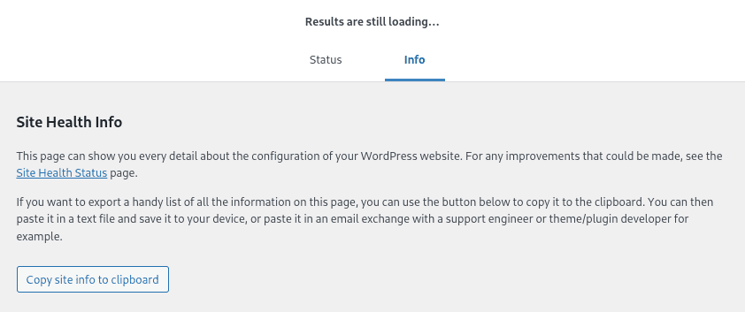
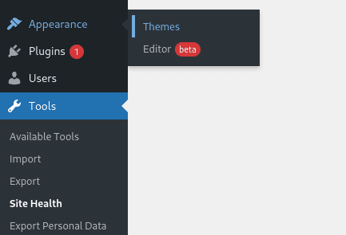
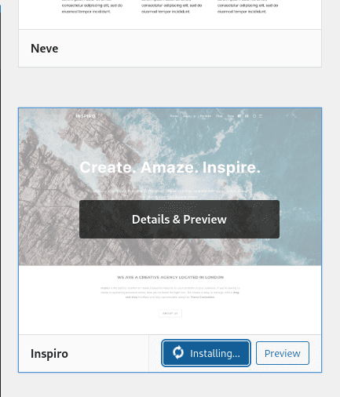
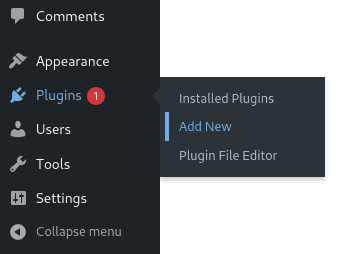
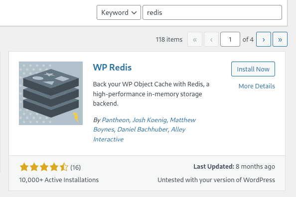

# Redis base for WordPress cache

Let's move on to the bonus part of the project. First, let's create a Redis database for caching our WordPress.

But first, we’ll make beauty out of our default wp because it’s somehow sad to see a poor default theme on your website.

Let's start with a check: let's see if we did everything right. Go to tools -> site health:


On the health page, go to the information tab:


Sorry, wrong screen... So, go to the info tab:



At the very bottom, open the “file system permissions” drop-down list. It should be like shown in the screenshot:


For the WordPress core, the entry should be inaccessible for security reasons, but for other sections it should be available.

If suddenly any write rights are missing or something is wrong, as in this screenshot, you can copy-paste the Dockerfile from the WordPress guide again and restart the project. It should work.

Next, let's install a normal theme. Go to the menu "appearance -> themes":



You can add a new topic using the "Add New" button:


Here we can choose any topic we like. I liked Inspiro:



After installation, instead of the “install” button, the “activate” button will appear. Click it and rejoice:


You can also experiment with installing plugins and designing at least the main page of the site. Just for practice. Well, then proceed to installing Redis.

## Step 1: Install Redis

First, as usual, let's create a Dockerfile for our radish.

If we don’t know which folder to start with, we’ll choose srcs for ourselves:

``cd ~/project/srcs``

Next, we will create a folder for bonuses and a directory for bonus projects:

``mkdir requirements/bonus``

``mkdir requirements/bonus/redis``

``mkdir requirements/bonus/vsftpd``

``mkdir requirements/bonus/adminer``

``mkdir requirements/bonus/website``

``mkdir requirements/bonus/website/conf``

In the redis directory we will create a Dockerfile:

``nano requirements/bonus/redis/Dockerfile``

Let's add the following code to it:

```
FROM alpine:3.16

RUN apk update && apk upgrade && \
apk add --no-cache redis && \
sed -i "s|bind 127.0.0.1|#bind 127.0.0.1|g" /etc/redis.conf && \
sed -i "s|# maxmemory <bytes>|maxmemory 20mb|g" /etc/redis.conf && \
echo "maxmemory-policy allkeys-lru" >> /etc/redis.conf

EXPOSE 6379

CMD [ "redis-server" , "/etc/redis.conf" ]
```

Here we selected the current version of alpine, installed radish there and slightly corrected its config. Then we opened the default port and launched the radish server, feeding it the finished config. Voila.

## Step 2: Configuring docker-compose

In docker-compose.yml we will add a radish section:

```
redis:
build:
context: .
dockerfile: requirements/bonus/redis/Dockerfile
container_name: redis
ports:
- "6379:6379"
networks:
- inception
restart: always
```

## Step 3. Launch and check

We restart the configuration again. Since we don’t have any extra configs and we don’t need to pass environment variables, we can go to the project folder and use the Makefile:

``make re``

After the project is assembled, let's check its operation as follows:

``docker exec -it redis redis-cli``

After this command we will be surrounded by radishes:

``127.0.0.1:6379>``

Here we have to enter a simple command:

``ping``

The answer should be:

``PONG``

If we received this response, then our server is working and responds perfectly. Congratulations on this wonderful event!

## Step 4. Install the WP Redis plugin

Go to WordPress plugin search page:



Enter “Redis” into the search and install the found plugin:



After installation, we need to click “Activate” and our plugin will work.

## Step 4. Check that Redis is working

To check the cache operation, run the following command:

``docker exec -it redis redis-cli monitor``

If the output is OK, then everything is working for us, we can exit the monitor using Ctrl+C. The radishes are running, let's disperse!


