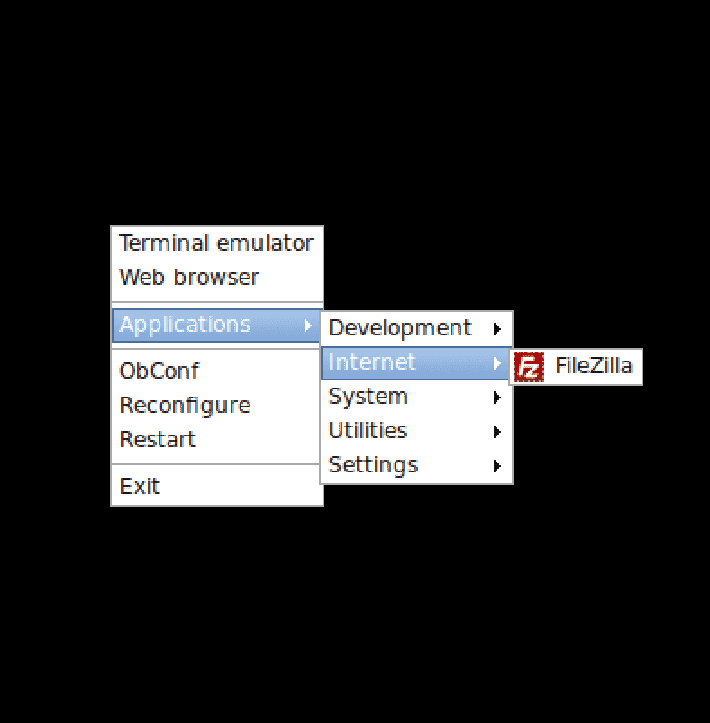
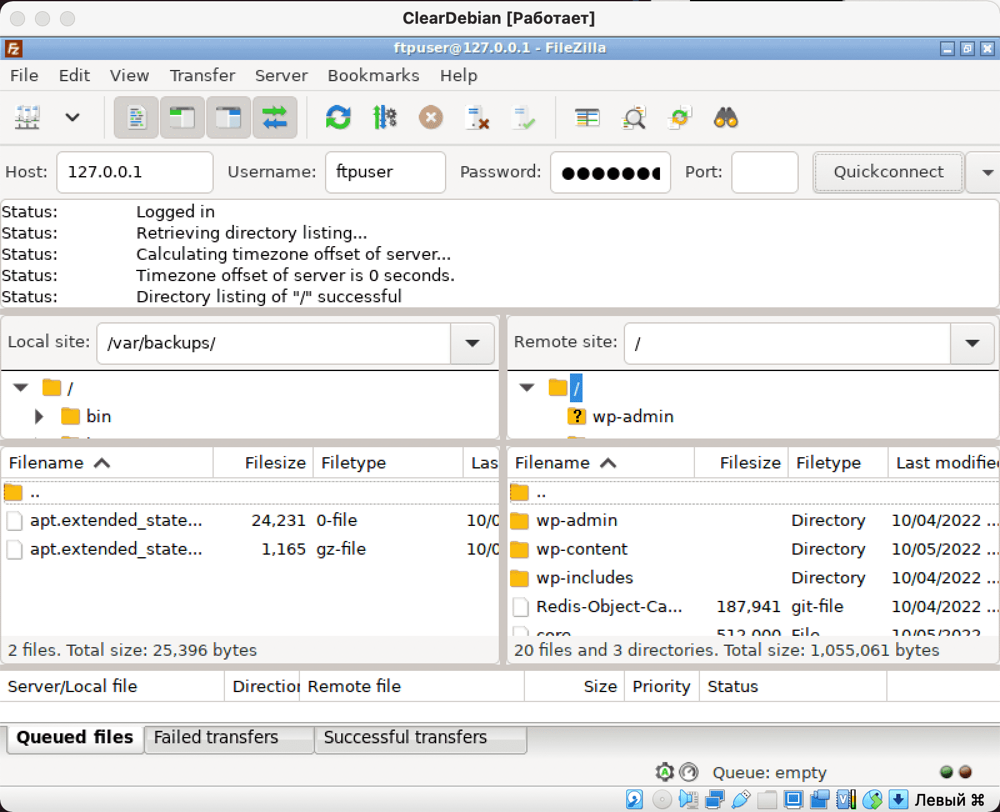

# File server vsftpd

So, guys, as we remember from pipex, files, along with processes, are the basic abstractions of Linux.


In the inception project, this knowledge will not be useful to us!

Let's be happy that we don't have to dive into low-level programming! After all, all we need now is just to write a container containing a file server for working with the WordPress section. And not these I/O streams of yours...

We will install the vsftpd server in the container - Very Saveful File TransPort Daemon, or translated from bourgeois - a very secure daemon transporting files. Based on the name, it seems like it should look like this:


However, in reality it looks like this:


The poor fellow doesn’t even have his own logo, so they usually photoshop it against the background of a Linux penguin called Tux.

## Step 1: Create a Dockerfile

As usual, we start with the Dockerfile:

``nano requirements/bonus/vsftpd/Dockerfile``

In it we will receive the username and password for our ftp server user in variables via ARG. Then we will install our vsftpd. We need to create a user to connect to the server, and with the next layer we will do this. We will set the home section to /var/www, where we will mount the section with our wp. Let’s not forget to add this user to the root group so that we can process the WordPress directory (otherwise we simply won’t have enough rights).

After this, we will correctly configure the configuration file - uncomment the parameters we need and add the missing ones. Let's make /var/www the root folder, open port 21 and launch our daemon, feeding it the newly configured vsftpd.conf file:

```
FROM alpine:3.16

ARG FTP_USR\
FTP_PWD

RUN apk update && apk upgrade && \
apk add --no-cache vsftpd

RUN adduser -h /var/www -s /bin/false -D ${FTP_USR} && \
echo "${FTP_USR}:${FTP_PWD}" | /usr/sbin/chpasswd && \
adduser ${FTP_USR} root

RUN sed -i "s|#chroot_local_user=YES|chroot_local_user=YES|g" /etc/vsftpd/vsftpd.conf && \
sed -i "s|#local_enable=YES|local_enable=YES|g" /etc/vsftpd/vsftpd.conf && \
sed -i "s|#write_enable=YES|write_enable=YES|g" /etc/vsftpd/vsftpd.conf && \
sed -i "s|#local_umask=022|local_umask=007|g" /etc/vsftpd/vsftpd.conf

RUN echo "allow_writeable_chroot=YES" >> /etc/vsftpd/vsftpd.conf &&\
echo 'seccomp_sandbox=NO' >> /etc/vsftpd/vsftpd.conf && \
echo 'pasv_enable=YES' >> /etc/vsftpd/vsftpd.conf

WORKDIR /var/www

EXPOSE 21

CMD [ "/usr/sbin/vsftpd", "/etc/vsftpd/vsftpd.conf" ]
```

## Step 2. Put secrets in .env

Open the .env file:

``nano.env``

Add lines with username and password there. So the entire file will look like this:

```
DOMAIN_NAME=jleslee.42.fr
CERT_=./requirements/tools/jleslee.42.fr
KEY_=./requirements/tools/jleslee.42.fr
DB_NAME=wordpress
DB_ROOT=rootpass
DB_USER=wpuser
DB_PASS=wppass
FTP_USR=ftpuser
FTP_PWD=ftppass
```

The login and password can be anything.

## Step 3. Add a section to docker-compose

In order for variables from .env to be transferred to the Dockerfile, you need to register them in docker-compose. Our daemon section will look like this:

```
vsftpd:
build:
context: .
dockerfile: requirements/bonus/vsftpd/Dockerfile
args:
FTP_USR: ${FTP_USR}
FTP_PWD: ${FTP_PWD}
container_name: vsftpd
ports:
- "21:21"
volumes:
- wp-volume:/var/www/
networks:
- inception
restart: always
```

At this point the setup stage is complete, let's move on to testing.

## Step 4. Verify that vsftpd is working

To check we need an ftp client. If we want to connect to the container from the outside, we will also have to forward a port with our school number to the outside (*for advertising purposes):


However, we are “poor students” of school-21 and our Macs don’t even have a set of essential software like postman or filezilla. At least not all computers have them. Therefore, we will not have to work on a Mac with this port externally; to check, we will install an ftp client inside the virtual machine. It makes sense to forward port 21 on a home PC/Laptop where you can install filezilla.

But port 9443 and 8080 will be useful to us in the following guides for such cool things as portainer and adminer.

Portainer is a functional dashboard that provides a convenient graphical environment for managing containers. Adminer is a lightweight graphical environment for database administration.

Since we are already into port forwarding, we need to open these ports for the future! And don’t forget to open the ports in the firewall:


Since I will run filezilla inside a virtual machine, I do not open port 21 externally.

Now let’s return to the terminal and install the filezilla ftp client in the virtual machine:

``sudo apt install -y filezilla``

While our filezilla is being installed, we go into the virtualbox window with our running system. Log in there and launch the graphics:

``sudo startx``

In openbox, after installation, our ftp client will be available in the internet tab:



We launch and log in to it on the local host (127.0.0.1), entering the login and password specified in the .env file, selecting the same 21st port:



Hurray, we have accessed our wp-volume section via ssh! We can poke around there, create folders and files, delete something not really necessary, break the project and rebuild it again - docker-compose gives us this wonderful opportunity!

So, thank the demons, we have FTP access configured. Let's move on to setting up the DBMS - database management system. About it - in the next guide.
