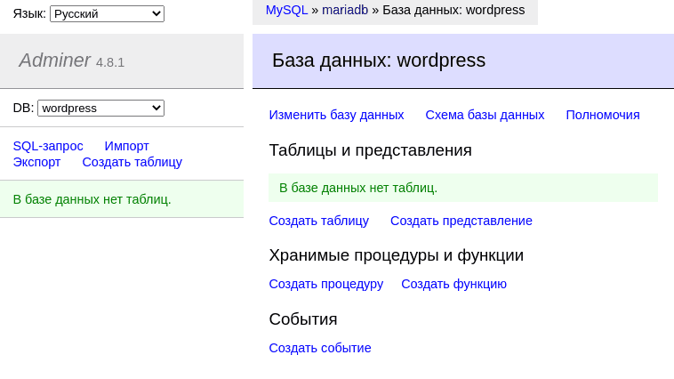

# Administrative interface adminer

Now we need to install the adminer administrative panel. In essence, this is a lightweight DBMS that contains just one php file!

Therefore, to deploy it, we need to install the version of php we need into the container, download our socket and feed it to the php interpreter. Sounds simple. The main thing is not to forget to open the ports.

Why is it even needed? In order to be able to open the database in graphical mode and ~~monitor the dummies~~ do any operations we need in it without SQL queries and manual commands.


Go!

# Step 1: Create a Dockerfile

Go to [adminer official website](https://www.adminer.org/ "download adminer") and look at the features and dependencies:


As we can see, adminer works with php-8 and supports our Masha. But how do you know which packages adminer needs as dependencies? I did not find this information in open sources, so I approached this issue from a different angle.

An analogue of adminer is PhpMyAdmin, and this thing runs on the same php. But unlike Adminer, all PhpMyAdmin dependencies are well documented in [alpine's wiki](https://wiki.alpinelinux.org/wiki/PhpMyAdmin "list of packages for PMA"). It was the instructions for PMA that helped me launch adminer: I took all the dependencies from here from the line “Install the additional packages” and ran them through [package search](https://pkgs.alpinelinux.org/packages?name=&branch=edge&repo=&arch =&maintainer="search for alpine packages"), replacing php7- with our current php8-.

Php8-mcrypt, php8-xmlrpc and, surprisingly, php8-json were eliminated. The surprise still turned out to be pleasant - if the first two packages are simply not implemented yet on alpine, the json module has been included in the php core since version 8.


I also removed the unnecessary lighttpd and fast cgi. So, the list of packages has been formed, let's start creating the Dockerfile:

``nano requirements/bonus/adminer/Dockerfile``

Let's take the same alpine 3.16 as a basis, add the php version to the variable and install all the packages we need from the ready list:

```
FROM alpine:3.16

ARG PHP_VERSION=8

RUN apk update && apk upgrade && apk add --no-cache \
php${PHP_VERSION}\
php${PHP_VERSION}-common\
php${PHP_VERSION}-session\
php${PHP_VERSION}-iconv\
php${PHP_VERSION}-gd\
php${PHP_VERSION}-curl\
php${PHP_VERSION}-xml\
php${PHP_VERSION}-mysqli\
php${PHP_VERSION}-imap\
php${PHP_VERSION}-cgi\
php${PHP_VERSION}-pdo\
php${PHP_VERSION}-pdo_mysql \
php${PHP_VERSION}-soap\
php${PHP_VERSION}-posix\
php${PHP_VERSION}-gettext\
php${PHP_VERSION}-ldap\
php${PHP_VERSION}-ctype\
php${PHP_VERSION}-dom\
php${PHP_VERSION}-simplexml\
wget

WORKDIR /var/www

RUN wget https://github.com/vrana/adminer/releases/download/v4.8.1/adminer-4.8.1.php && \
mv adminer-4.8.1.php index.php && chown -R root:root /var/www/

EXPOSE 8080

CMD [ "php", "-S", "[::]:8080", "-t", "/var/www" ]
```

As you can see, I make the working directory /vaar/www, download adiner to this directory and call it index.php because the interpreter needs to feed the folder, and in the folder it looks for the index file.

Then I open the adminer’s working port and in CMD I point the PHP interpreter at our working directory with the index file. So php will see our file and launch adminer.

# Step 2: docker-compose configuration

Add the adminer section to docker-compose:

```
admin:
build:
context: .
dockerfile: requirements/bonus/adminer/Dockerfile
container_name: admin
depends_on:
- mariadb
ports:
- "8080:8080"
networks:
- inception
restart: always
```

It should start after mariadb, port 8080 should be open. We connect it to our inception network.

# Step 3. Restart the configuration

So, we have done everything we need, all that remains is to launch our configuration. However, we will do a little check to clearly see at what stage the WordPress database is created.

These actions will delete all files and settings of our WordPress, so all important data must be saved. If you do not want to delete the configuration, then you can simply familiarize yourself with this and the subsequent steps.

First, let's go to the directory with our Makefile:

``cd ~/project/``

Now let’s clear the entire configuration, including files from the wordpress section with the command

``make clean``

And let's hit it again:

``make build``

When everything starts, the first thing we do is open the browser of the host (not virtual, although it is possible there, but since the ports are forwarded, then why limit yourself?) The address of our adminer:

``http://localhost:8080/``

And we will see the login page:


This way we made sure that everything works for us! So what to do about it?

# Step 4. Login to adminer

First, we need a username and password. Let's look at our .env file with cat:

``cat .env``

We will get the following output:

```
DOMAIN_NAME=jleslee.42.fr
CERT_=./requirements/tools/jleslee.42.fr
KEY_=./requirements/tools/jleslee.42.fr
DB_NAME=wordpress
DB_ROOT=rootpass
DB_USER=wpuser
DB_PASS=wppass
FTP_USR=ftpuser
FTP_PWD=ftppass
```

From here we need the database user login and password:

```
DB_USER=wpuser
DB_PASS=wppass
```

We enter them into the input fields, and enter “mariadb” as the database host:


Upon entering, we will see two bases. Select the base for our WordPress:


And we will see... An empty database:



But this is not a bug. We cleared our configuration and rebuilt everything again. Now we need to set up WordPress from scratch to make it all work.

First, let's install WordPress itself.

# Step 5. Install WordPress

In the host browser, follow the link:

``https://localhost/``

Repeat step 7 of guide 09: run the wp installation and enter all your data:


After installation, go to adminer and make sure that the database has been created:


Now we know exactly when the wp database is created. Now feel free to connect the plugin for redis, customize the theme and design your site as you please - we won’t drop it anymore.

You can also experiment with the base, change the configuration, break the site and deploy it again. Docker containers allow us to do this over and over again.
