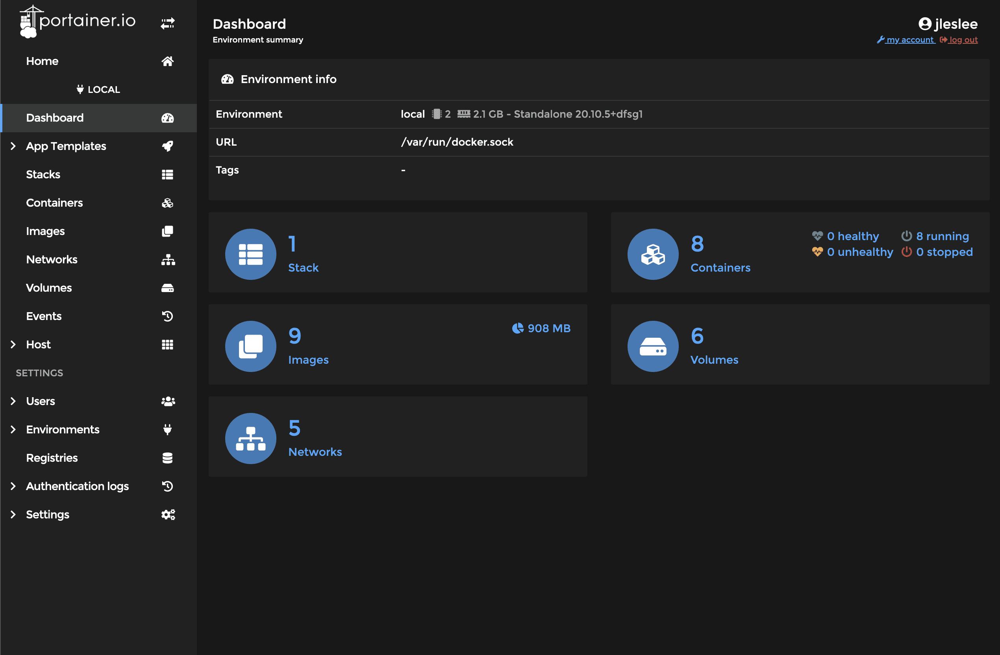
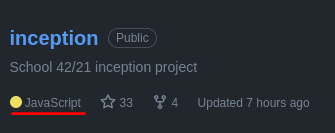

# Custom website and installation of portainer


## Step 1. Custom website

According to the assignment, we must create a custom website using the technology that is closer to us. Here everyone chooses for themselves which language to use and which container to create. Those who like JS can use a container with nodejs and react, Python lovers can create a page in Django, etc. I didn’t bother and used a ready-made solution to create the page - a wysiwyg editor for generating static html.

The site itself is located in ``requirements/bonus/website/conf``, it can be opened directly in the browser, since it is html.

## Step 2. Dockerfile

We take the Dockerfile from our nginx, since we will run the html site on the same nginx. We change the default config located at ``/etc/nginx/http.d/default.conf`` by placing a simple code there indicating a different location instead of the standard one (/var/www):

```
FROM alpine:3.16
RUN apk update && apk upgrade && apk add --no-cache nginx

RUN echo "server {" > /etc/nginx/http.d/default.conf && \
echo "root /var/www;" >> /etc/nginx/http.d/default.conf && \
echo "location / {" >> /etc/nginx/http.d/default.conf && \
echo " try_files \$uri /index.html;" >> /etc/nginx/http.d/default.conf && \
echo "}}" >> /etc/nginx/http.d/default.conf

COPY requirements/bonus/website/conf/* /var/www/

EXPOSE 80
CMD ["nginx", "-g", "daemon off;"]
```

We copy all the contents of the site using the mask * to our folder /var/www. Open port 80 (no need to forward it, the port is already open in the system). Well, we launch nginx without daemonization.

## Step 3. Section in docker-compose

Here we simply take the same source data as in WordPress, but remove everything unnecessary.

```
website:
build:
context: .
dockerfile: requirements/bonus/website/Dockerfile
container_name: website
ports:
- "80:80"
restart: always
```

We have port 80 free, let's connect it to our website, without the need to roll out ssl.

## Step 4. Launching the site

If we did everything correctly, go to the project folder and do ``make re``. After restarting the project, go to ``http://localhost`` and see the result:


As you can see, there is nothing complicated in this bonus point. But this particular point can be complicated indefinitely. Although, it is unlikely that there will be anyone who wants to practice writing a website in ASP.NET as part of a school project. But in general this is possible.

## Step 5. Portainer

Installing portainer will differ from installing other containers in that portainer will not depend on our docker-compose, and on the contrary, all our containers will be managed through portainer.

This is a cool and very convenient utility with a graphical dashboard for managing containers, and you will soon regret that you got to know it so late, only at the end of the project. It would make writing inception a lot easier for us, but we’re not looking for easy ways, are we?

To install portainer we will use [official documentation](https://docs.portainer.io/v/ce-2.11/start/install/server/docker/linux "install portainer"). At the time of writing the inception project, the commands were as follows (if they change, refer to the official documentation, not the project guide):

First we will create a section for the portainer data:

``docker volume create portainer_data``

Then download and install the portainer container via docker:

```
docker run -d -p 8000:8000 -p 9443:9443 --name portainer --restart=always -v /var/run/docker.sock:/var/run/docker.sock -v portainer_data:/data portainer/ portainer-ce:2.11.1
```

We check on the page of the official website whether the commands have changed, execute the current ones and after installation check the portainer page:

``https://localhost:9443``

We receive the already familiar warning about a self-signed certificate (yes, professional software uses them too!), ignore it and go to the page. First, we will be asked to come up with a password for the dashboard. You can also change the username. I entered everything that I entered for WordPress and clicked “create user”.

After being redirected to the portainer page, I went to ``https://localhost:9443/#!/home`` and saw our local docker configuration. Clicking on it took me to the control page:



As we can see, we end up with:

- 1 Stack (one docker-compose file)
- 8 Containers (7 project containers and the 8th one is the portainer itself)
- 9 Images (alpine:3.16 is reused many times, therefore it is presented in a separate image)
- 6 Sections (3 system for docker, wp-wolume db-volume sections and portainer_data section)
- 5 Networks (3 system + default project network + our manually created inception network)

All this can be controlled directly from the portainer. You can also create new containers, change old ones, launch entire docker-compose configurations - in general, manage our container zoo as you please. Portainer makes it possible to manage all Docker features through a graphical interface.


But that's a completely different story...

## RESULTS

So, our task is completed, we have created everything that we need for the task.

Hurray, Kazan, I finished writing my guide!


Now you can give me a ~~plus sign in my karma~~ a star in the Gita and take inception with bonuses. A ~~Dobby is free~~ I'll go and reward myself with lunch at a good canteen (as an advertisement*).

And finally, a little humor from GitHub:



By the way, the JS libraries of the artisteer-generated website really take up the most code. So all this time we were writing a JS project, for which I congratulate us.
